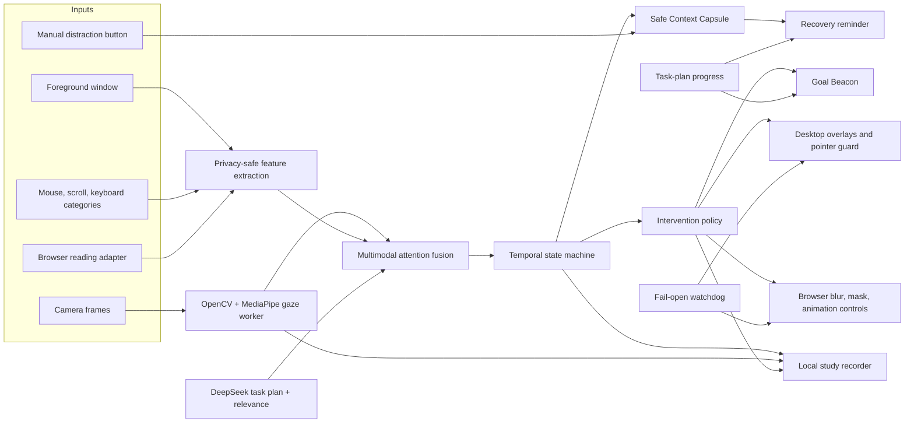

# Anchor

Anchor is a Windows attention-support assistant for people with ADHD and related executive-function difficulties. Like Grammarly, it lives quietly in the background: Settings is used to configure a task, gaze, and the toolkit; the notification-area icon and small Goal Beacon remain available while the user works in browsers or desktop apps.

Anchor is assistive software, not a diagnostic tool or medical device. Its attention state is an estimate and can be wrong.

## Release quick start

Download `Anchor-win-x64.zip` from the GitHub Releases page (or build it with `scripts\build.ps1`, which writes `release/Anchor-win-x64`), extract it anywhere, and:

1. Run `Anchor.exe`. No Python or .NET installation is required.
2. In **DeepSeek intelligence**, enter an API key and save. DeepSeek then becomes the default planner, screen-progress judge, and reminder writer (there is no separate on/off switch); without a key Anchor uses a clearly labeled local fallback.
3. In **Test Gaze**, select **Find cameras**, choose a camera, select **Start**, tune mirror/rotation/offset/smoothing/sensitivity, and complete the nine-point calibration if needed. If no camera is listed, run `camera-check.ps1` from the extracted folder: it reports what Windows, the camera privacy switches, and Anchor's OpenCV worker each see, and which app currently holds the device.
4. Enter a goal, select **Plan goal**, review the subtasks, and select **Start focus session**.
5. Closing Settings hides it; Anchor keeps running from its stationary notification-area icon. Use `Ctrl+Shift+A` to reopen Settings.

Safety controls:

- `Ctrl+Shift+F12`: report distraction and open the saved context reminder immediately.
- `Esc`: immediately release overlays and pointer restrictions.
- Notification-area menu: open Settings, report distraction, emergency release, or exit Anchor.

## Implemented system

- Computer-vision gaze estimation using OpenCV and MediaPipe, with camera discovery, live preview, adjustable calibration, confidence, face-presence, and fail-open behavior.
- Multimodal attention fusion across gaze, foreground app and redacted title, semantic relevance, app switches, mouse behaviour, scroll bursts, and keyboard behaviour including typing into a page that accepts no input. Stillness counts for nothing; only movement in excess of the work does. Raw keys are never stored.
- DeepSeek-powered goal decomposition, subtask breakdown, and task-relevance classification, with timeouts and deterministic fallback.
- A Goal Beacon that shows the current subtask, advances when the user completes a step, and pulses/shakes when sustained evidence indicates drift.
- Active prevention: gaze spotlight, peripheral dimming, low-relevance window firewall, intention gate, optional pointer guard, dynamic browser image blur, future-text masking, reversible animation suppression, and reversible HTML edits that delete off-task blocks and trim sentences in the focused browser.
- Passive recovery: a Context Capsule saves the most recent safe task anchor before distraction. Manual and automatic recovery can show the prior location, last action, next step, recap, reopen, and smaller-step controls.
- Reading support: progress tracking, large-skip detection, and repeated-phrase dwell detection.
- Local study recording: Display 1 at 15 FPS with the gaze point, the attention state with its distraction rating and confidence, and — when the camera is open — the camera view with the eyes enlarged, all composited into one MP4 (**Record screen + eyes + rating** on the Camera page), plus aligned event JSONL, gaze/sample CSV, summary JSON, and manifest JSON. Baseline mode senses but suppresses interventions.
- A **Compare recordings** control that compares one baseline and one Anchor-enabled summary without claiming clinical significance.
- Local SQLite timeline and focus/recovery metrics, protected-window suppression, authenticated local IPC, watchdog release, and deterministic replay scenarios.

## What the distraction decision actually uses

Every signal below is collected and reaches `AttentionFusion` → `AttentionStateMachine`; nothing in this
list is decorative.

| Signal | How it is collected | How it is used |
| --- | --- | --- |
| Foreground app and window title | `GetForegroundWindow` + redacted title | Relevance against the goal; app switches count as churn |
| Page/window semantic relevance | On-screen OCR text graded by DeepSeek (cached per page) | Main relevance term; local keyword rules only without a key |
| On-screen text and pictures | `Windows.Media.Ocr` + screen capture, pictures graded by the vision model | Sentence/picture treatment and progress evidence |
| Step progress | Screen evidence matched to the current step | Removes distraction evidence, auto-ticks the step |
| Idle time | Raw input timestamps | Never evidence on its own — reading, watching and thinking all look idle. Only a still seat plus a camera that sees nobody reports `away_from_screen` |
| Scrolling | Raw input wheel notches and direction flips | Fast/erratic scroll bursts; anchors the reminder to the page before the burst |
| Mouse motion and clicks | Raw input path length, net displacement, direction changes, click rate | Travel far beyond what the work needs, aimless drift and click mashing |
| Keyboard | Per-category key counts (letters, digits, navigation, editing, modifiers, function) — raw keys are never stored | Typing quality (gibberish) and random typing: bursts while the foreground window has no text caret and the screen text does not change |
| Text caret presence | `GetGUIThreadInfo` on the foreground thread | Separates typing into an editor from typing into a page that accepts no input |
| Browser page and reading position | DevTools `Runtime.evaluate` in the focused browser | Recovery card location, reading progress and skips |
| Gaze | Worker eye-region estimation, only when a camera is open and confidence is sufficient | Sustained gaze away from the task region; missing gaze is never treated as distraction |
| Manual reports | Beacon and recovery controls | Direct evidence, and marks a window relevant |

Worker or camera unavailability is reported as a capability state and never counted as evidence of
distraction.

## Architecture



The desktop host is a self-contained .NET executable. The CV/recording worker is a bundled one-file Python executable. Their protocol version and a random per-launch authentication token are checked before use.

## Browser pages

Press **Open focused browser** on the Tools page. Anchor starts Chrome or Edge in its own profile with a
local DevTools port and edits the pages you open there directly: off-task blocks are emptied while keeping
their height, long or unrelated sentences are trimmed, and distracting pictures are swapped for a
low-resolution copy. Turning the tools off, or ending the session, restores the original markup. Nothing is
installed and there is no extension to load.

Browser-internal pages and password/payment pages are never edited.

## Build from source

Requirements: Windows 11 x64, PowerShell, Node.js, and the repository's `.tools` and `.venv` environments.

```powershell
.\scripts\build.ps1
```

The build restores dependencies, runs the core, infrastructure, worker and browser test suites, and three deterministic replay audits. It then publishes and launches the self-contained release as a smoke test. Output: `release/Anchor-win-x64`.

For a faster development-only verification without packaging:

```powershell
.\scripts\build.ps1 -SkipPublish
```

Deterministic demos:

```powershell
.\scripts\run-demo.ps1 -Scenario all
```

## Study recording

Use a pseudonymous participant code. Start a planned focus session before recording. Record comparable activities and durations in this order:

1. Select **Baseline · interventions off**, start recording, perform the task, then stop.
2. Select **Anchor enabled**, repeat the task with Anchor support, then stop.
3. Select **Compare recordings** and choose the baseline summary followed by the enabled summary.

The report shows deltas in usable gaze coverage, gaze-away time, distracted/low-relevance time, interruption count, recovery time, and completed subtasks. It is observational evidence from a prototype, not a clinical result.

## Repository map

```text
src/Anchor.Core             task plans, fusion, state, policy, recovery, replay
src/Anchor.Infrastructure   DeepSeek, persistence, Windows sensors, IPC, safety
src/Anchor.Desktop          WinUI Settings, tray lifecycle, overlays, recording UI
src/Anchor.Worker           camera gaze and screen-recording worker
browser/anchor-page-agent   page edits injected over the DevTools protocol
tests                       C# unit and integration tests
demo/replay                 reproducible scenarios
docs                        design, privacy, and demo documentation
scripts                     build, verification, and demo
```

## Honest prototype limits

- The release is unsigned; Windows may display an unknown-publisher warning.
- Browser DOM editing requires the focused browser Anchor launches; pages opened in another browser profile are only treated by the desktop pixel overlay.
- Object-level picture blur is available in browser pages; desktop apps receive safe dimming/spotlight overlays rather than OCR-based object segmentation.
- Audio is never recorded. The camera view is only written into a recording while the camera is open and you start one; the evidence clip then contains your face and eyes, so it stays in the local output folder unless you share it.
- Gaze quality depends on lighting, camera placement, eyewear, and calibration. Missing or low-confidence gaze becomes `Unknown`; it is not treated as proof of distraction.
- Site sign-in, DRM/protected pages, and secure Windows surfaces can limit interventions or recording.

Read [privacy and safety](docs/privacy.md) before testing with real work. The full accepted design is [here](docs/superpowers/specs/2026-09-20-anchor-release-rebuild-design.md).
