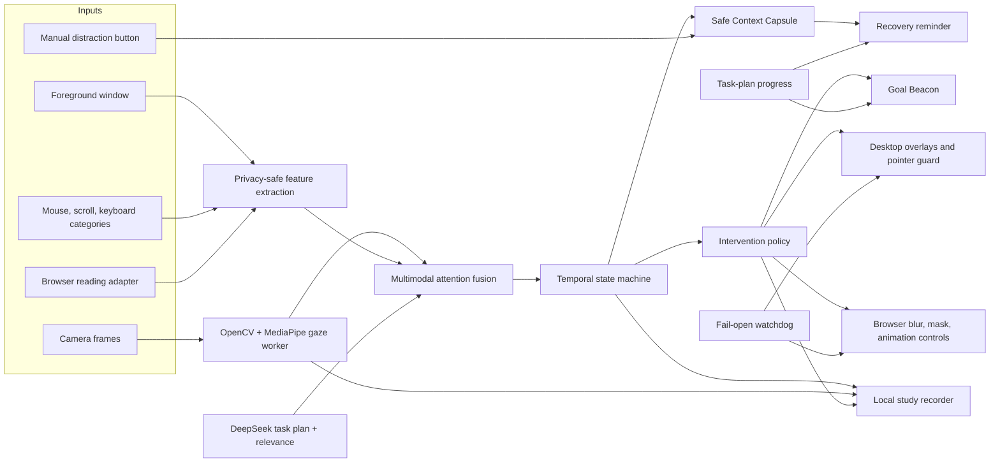

# Anchor

Anchor is a Windows attention-support assistant for people with ADHD and related executive-function difficulties. Like Grammarly, it lives quietly in the background: Settings is used to configure a task, gaze, and the toolkit; the notification-area icon and small Goal Beacon remain available while the user works in browsers or desktop apps.

Anchor is assistive software, not a diagnostic tool or medical device. Its attention state is an estimate and can be wrong.

## Release quick start

The generated portable release is `release/Anchor-win-x64`.

1. Run `Anchor.exe`. No Python or .NET installation is required.
2. In **DeepSeek intelligence**, optionally enter an API key, enable DeepSeek, and save. Without it, Anchor uses a clearly labeled local fallback plan and relevance model.
3. In **Test Gaze**, select **Find cameras**, choose a camera, select **Start**, tune mirror/rotation/offset/smoothing/sensitivity, and complete the nine-point calibration if needed.
4. Enter a goal, select **Plan goal**, review the subtasks, and select **Start focus session**.
5. Closing Settings hides it; Anchor keeps running from its stationary notification-area icon. Use `Ctrl+Shift+A` to reopen Settings.

Safety controls:

- `Ctrl+Shift+F12`: report distraction and open the saved context reminder immediately.
- `Esc`: immediately release overlays and pointer restrictions.
- Notification-area menu: open Settings, report distraction, emergency release, or exit Anchor.

## Implemented system

- Computer-vision gaze estimation using OpenCV and MediaPipe, with camera discovery, live preview, adjustable calibration, confidence, face-presence, and fail-open behavior.
- Multimodal attention fusion across gaze, foreground app and redacted title, semantic relevance, idle time, app switches, mouse distance, scroll reversals, and keyboard-category counts. Raw keys are never stored.
- DeepSeek-powered goal decomposition, subtask breakdown, and task-relevance classification, with timeouts and deterministic fallback.
- A Goal Beacon that shows the current subtask, advances when the user completes a step, and pulses/shakes when sustained evidence indicates drift.
- Active prevention: gaze spotlight, peripheral dimming, low-relevance window firewall, intention gate, optional pointer guard, dynamic browser image blur, future-text masking, and reversible animation suppression.
- Passive recovery: a Context Capsule saves the most recent safe task anchor before distraction. Manual and automatic recovery can show the prior location, last action, next step, recap, reopen, and smaller-step controls.
- Reading support: progress tracking, large-skip detection, and repeated-phrase dwell detection.
- Local study recording: Display 1 at 15 FPS with gaze point and task state composited into MP4, plus aligned event JSONL, gaze/sample CSV, summary JSON, and manifest JSON. Baseline mode senses but suppresses interventions.
- A **Compare recordings** control that compares one baseline and one Anchor-enabled summary without claiming clinical significance.
- Local SQLite timeline and focus/recovery metrics, protected-window suppression, authenticated local IPC, watchdog release, and deterministic replay scenarios.

## Architecture



The desktop host and browser native bridge are self-contained .NET executables. The CV/recording worker is a bundled one-file Python executable. Their protocol version and a random per-launch authentication token are checked before use.

## Browser adapter

1. Open `chrome://extensions` or `edge://extensions`.
2. Enable developer mode, select **Load unpacked**, and choose `browser-extension` from the release folder (or `browser/anchor-extension` in the repository).
3. Copy the extension ID shown by the browser.
4. In PowerShell, from the release folder, run:

```powershell
.\register-browser-bridge.ps1 -ExtensionId YOUR_32_CHARACTER_EXTENSION_ID
```

5. Click the Anchor extension once on each site where support should be enabled. Permission is opt-in per origin and survives navigation on that origin.

The extension excludes browser-internal pages, password/payment/editable fields, dialogs, media, and user-denied origins. Remove the native registration with `./unregister-browser-bridge.ps1`.

## Build from source

Requirements: Windows 11 x64, PowerShell, Node.js, and the repository's `.tools` and `.venv` environments.

```powershell
.\scripts\build.ps1
```

The build restores dependencies, runs 73 core tests, 41 infrastructure tests, 32 worker tests, 12 browser tests, and three deterministic replay audits. It then publishes and launches the self-contained release as a smoke test. Output: `release/Anchor-win-x64`.

For a faster development-only verification without packaging:

```powershell
.\scripts\build.ps1 -SkipPublish
```

Deterministic demos:

```powershell
.\scripts\run-demo.ps1 -Scenario all
```

## Study recording

Use a pseudonymous participant code. Start a planned focus session before recording. Record comparable activities and durations in this order:

1. Select **Baseline · interventions off**, start recording, perform the task, then stop.
2. Select **Anchor enabled**, repeat the task with Anchor support, then stop.
3. Select **Compare recordings** and choose the baseline summary followed by the enabled summary.

The report shows deltas in usable gaze coverage, gaze-away time, distracted/low-relevance time, interruption count, recovery time, and completed subtasks. It is observational evidence from a prototype, not a clinical result.

## Repository map

```text
src/Anchor.Core             task plans, fusion, state, policy, recovery, replay
src/Anchor.Infrastructure   DeepSeek, persistence, Windows sensors, IPC, safety
src/Anchor.Desktop          WinUI Settings, tray lifecycle, overlays, recording UI
src/Anchor.Worker           camera gaze and screen-recording worker
src/Anchor.NativeBridge     browser-to-desktop native messaging adapter
browser/anchor-extension    DOM-aware browser support
tests                       C# unit and integration tests
demo/replay                 reproducible scenarios
docs                        design, privacy, and demo documentation
scripts                     build, verification, demo, and bridge setup
```

## Honest prototype limits

- The release is unsigned; Windows may display an unknown-publisher warning.
- Browser DOM controls require the unpacked extension and native-host registration.
- Object-level picture blur is available in browser pages; desktop apps receive safe dimming/spotlight overlays rather than OCR-based object segmentation.
- Webcam video and audio are not recorded. The camera is used live for gaze inference; recording captures the desktop, gaze marker, task state, and structured events.
- Gaze quality depends on lighting, camera placement, eyewear, and calibration. Missing or low-confidence gaze becomes `Unknown`; it is not treated as proof of distraction.
- Site sign-in, DRM/protected pages, and secure Windows surfaces can limit interventions or recording.

Read [privacy and safety](docs/privacy.md) before testing with real work. The full accepted design is [here](docs/superpowers/specs/2026-09-20-anchor-release-rebuild-design.md).
