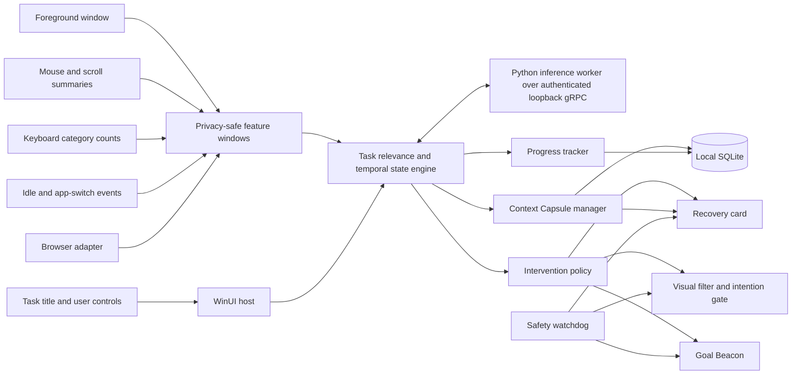

# Anchor

Anchor is a Windows attention-support prototype for people with ADHD and related executive-function difficulties. It behaves like a background writing assistant: the user declares one concrete task, Anchor quietly observes local interaction patterns, and it appears only when prevention or recovery may help.

This is an assistive hackathon project, not a diagnostic tool or medical device. It estimates uncertain interaction states and can be wrong.

## What is implemented

- A native Windows 11 dashboard and background session host
- A persistent Goal Beacon showing the current intention
- Attention inference from foreground-app relevance, idle time, app switching, mouse distance, keyboard-category counts, scroll loops, worker availability, and manual reports
- Explicit `Focused`, `Drifting`, `Distracted`, `Recovering`, `Stuck`, and `Unknown` states with confidence and reason codes
- Active prevention through beacon pulses, a visual filter, an intention gate, and an opt-in pointer guard
- Passive Context Capsules that preserve the last safe task location, prior action, and suggested next action
- A global **I'm distracted** recovery path that bypasses automatic thresholds
- A recovery card with Resume, Reopen, Recap, Break down, and Dismiss actions
- Focus time, interruption count, recovery time, and an event timeline stored in local SQLite
- A Manifest V3 browser adapter with dynamic image blur, future-text masking, reading-skip detection, stuck-phrase detection, and protected-page exclusions
- Authenticated loopback gRPC between the C# host and a local Python inference worker, with deadlines, restart limits, and deterministic fallback
- Emergency release through `Esc`, focus loss, `Ctrl+Shift+F12`, secure-window detection, shutdown, and a fail-open watchdog
- Deterministic replay scenarios for drift, interruption recovery, and stuck reading

The complete product and function specification is in [the approved design](docs/superpowers/specs/2026-09-19-anchor-general-task-assistant-design.md).

## System architecture



Raw keystrokes, pointer coordinates, microphone recordings, and continuous screenshots are not persisted. The browser adapter does not request browsing-history permission.

## Runtime flow

1. The user enters a concrete task title and starts a session.
2. Windows sensors aggregate activity without storing typed content.
3. The task-relevance and temporal engines combine multiple weak signals instead of treating one gaze, click, or idle period as proof.
4. Anchor preserves the latest safe Context Capsule before any intervention.
5. The intervention policy escalates from a beacon pulse to reversible visual friction or a recovery card.
6. The user's response adjusts future sensitivity; dismissals make the detector less aggressive.
7. Progress and recovery metrics remain on the device and can be deleted from the dashboard.

## Technical stack

| Layer | Technology | Purpose |
|---|---|---|
| Windows host | .NET 10, C# 14, WinUI 3, Windows App SDK 2.5 | UI, native hooks, overlays, lifecycle, safety |
| Core engine | Pure C# records and services | State machine, temporal evidence, policy, recovery, replay |
| Persistence | Microsoft.Data.Sqlite, WAL mode | Local event history and deletion |
| Worker IPC | gRPC, Protocol Buffers, random per-launch token | Bounded local process communication |
| Inference worker | Python 3.11–3.12, NumPy, grpcio | Feature normalization and temporally smoothed scoring |
| Optional vision | OpenCV and MediaPipe extras | Future coarse head-pose and gaze signals |
| Browser adapter | Manifest V3 JavaScript and CSS | DOM-aware blur, reading masks, and progress signals |
| Verification | xUnit, pytest, Node test runner | Domain, integration, worker, browser, and replay tests |

## Run the project

Requirements: Windows 11 x64, PowerShell, Node.js, and the project-local runtimes already present in `.tools` and `.venv`.

```powershell
./scripts/build.ps1
```

The script restores dependencies, runs the .NET, Python, browser, and replay suites, then publishes a self-contained single-file Windows build to `artifacts/Anchor-win-x64`. The executable extracts its bundled Windows App SDK dependencies to a temporary directory on first launch.

For development launch with a temporary Windows App SDK identity:

```powershell
$env:DOTNET_CLI_HOME = "$PWD/.tools/dotnet-home"
$env:NUGET_PACKAGES = "$env:DOTNET_CLI_HOME/.nuget/packages"
./.tools/dotnet/dotnet.exe run --project src/Anchor.Desktop/Anchor.Desktop.csproj
```

Global controls while Anchor is running:

- `Ctrl+Shift+F12`: report distraction and open recovery immediately
- `Ctrl+Shift+A`: restore the hidden dashboard
- `Esc`: release active overlays and pointer restrictions

## Browser adapter

1. Open the browser's extension-management page.
2. Enable developer mode and choose **Load unpacked**.
3. Select `browser/anchor-extension`.
4. Click the Anchor extension on a page to enable support for that tab.

The extension is opt-in per tab through `activeTab`. It excludes browser-internal URLs, password forms, payment forms, editable regions, dialogs, and user-denied origins. A native messaging host registration is optional; without it, page-local visual and reading tools still work.

## Deterministic demos

```powershell
./scripts/run-demo.ps1 -Scenario all
./scripts/run-demo.ps1 -Scenario focused-to-distracted
./scripts/run-demo.ps1 -Scenario interrupted-and-returned
./scripts/run-demo.ps1 -Scenario stuck-reading
```

The replay files are ordinary JSON Lines under `demo/replay`. Their expected states and interventions are asserted by the test suite, so the demo is repeatable even without a camera, browser extension, or network connection. See [the demo guide](docs/demo-script.md).

## Repository map

```text
src/Anchor.Core             domain, attention engine, policy, recovery, replay
src/Anchor.Infrastructure   SQLite, Windows sensors, safety, worker lifecycle
src/Anchor.Desktop          WinUI dashboard and overlays
src/Anchor.Worker           local Python inference worker
src/Anchor.Demo             deterministic scenario runner
browser/anchor-extension    optional DOM-aware browser adapter
tests                       C# unit and integration tests
demo/replay                 reproducible hackathon stories
docs                        design, privacy, and demo documentation
scripts                     build and demo entry points
```

## Known prototype limits

- Camera, audio, OCR, semantic embeddings, and application-specific Office/VS Code adapters remain extension points rather than required MVP dependencies.
- Cross-application picture blur is represented by a safe dimming overlay; true object-level blur is implemented only in the browser adapter.
- Automatic workspace reopening is deliberately conservative; the recovery card shows the saved identity instead of launching an untrusted target.
- Native messaging registration is not installed automatically.
- The dashboard hides to the background during an active session and is restored by shortcut; a signed installer and notification-area packaging are post-hackathon work.

See [privacy and safety](docs/privacy.md) before testing with real work.
