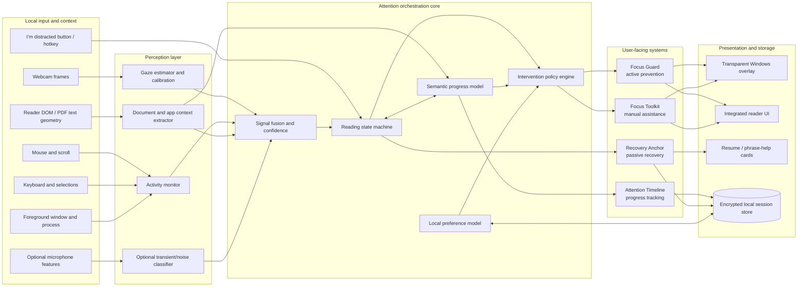
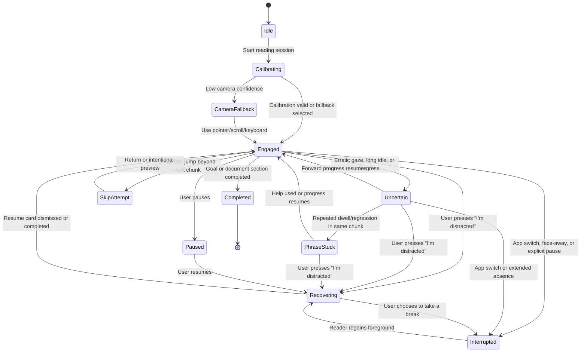
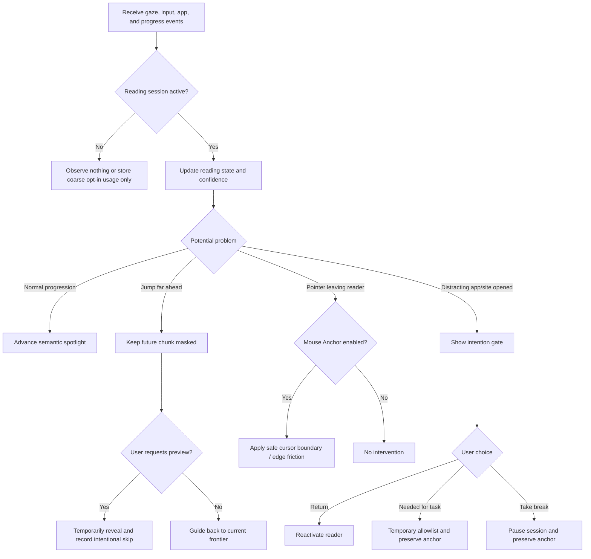
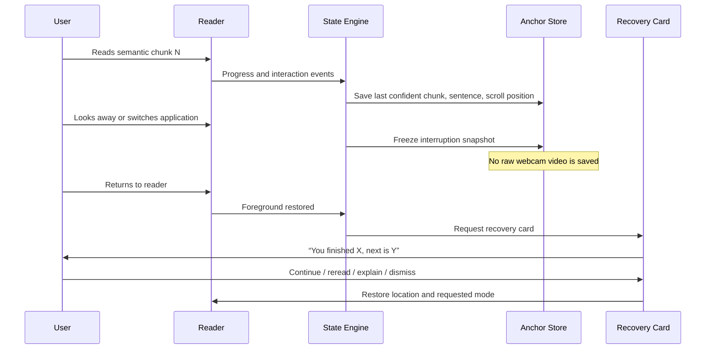
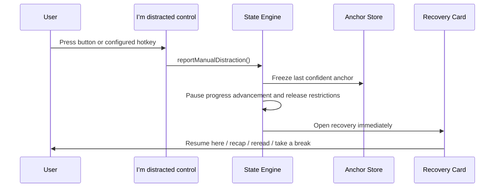
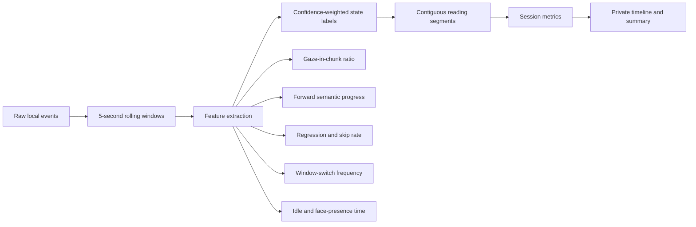
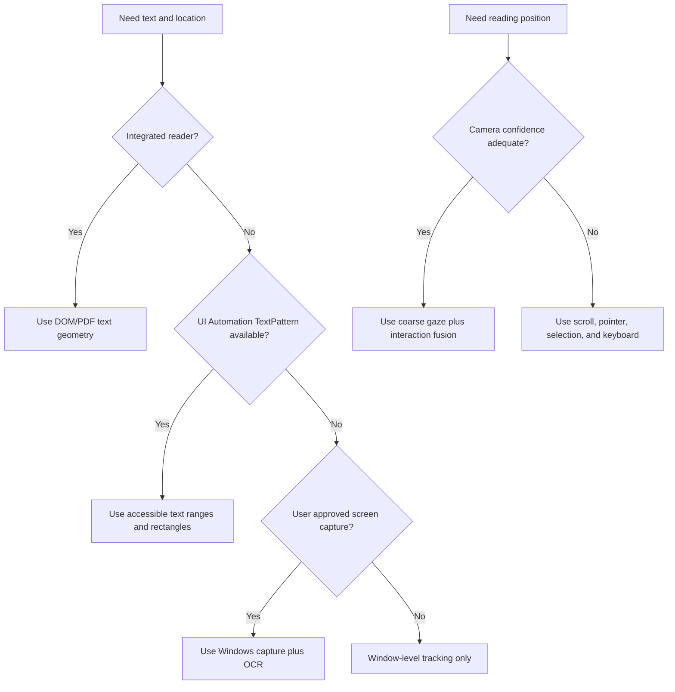
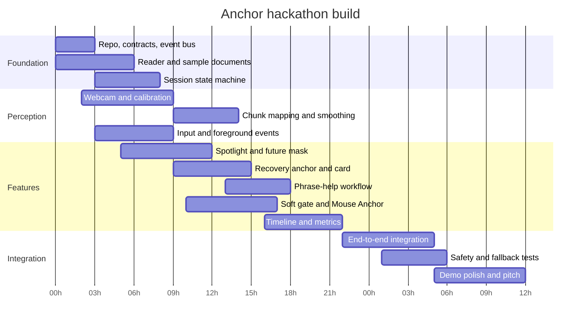

# Anchor: Attention-Adaptive Reading Assistant for Windows

**Status:** Approved design draft  
**Date:** 2026-09-04  
**Primary platform:** Windows 10/11 desktop  
**Hackathon form:** Hybrid desktop application with an integrated reader and limited system-wide protection  
**Target users:** People with ADHD and related attention or executive-function disabilities

## 1. Executive summary

Anchor is a Windows desktop accessibility application that adapts the reading interface to the user's changing attention. Existing tools usually provide a static reading ruler, manually configured Focus mode, a timer, or a fixed blocklist. Anchor combines four systems:

1. **Focus Guard — active prevention:** reduces opportunities to skip ahead or leave the task by progressively revealing text, dimming irrelevant content, gating distracting apps/sites, and optionally confining the mouse to the reading window.
2. **Recovery Anchor — passive and user-triggered recovery:** silently saves the user's reading context and restores it after an interruption or attention lapse. A persistent **“I’m distracted”** button and configurable hotkey let the user invoke the same recovery flow when automatic detection misses the lapse.
3. **Attention Timeline — progress tracker:** estimates reading continuity, semantic progress, skips, regressions, stuck regions, interruptions, and recovery time without presenting the result as a clinical measurement.
4. **Focus Toolkit — user-controlled assistance:** provides a manual ruler, semantic spotlight, read-aloud mode, phrase explanations, reduced-motion view, soundscapes, and configurable pacing.

The product's main insight is:

> Existing focus tools require the user to manage the tool. Anchor manages the interface around the user's current reading state.

Anchor does **not** claim to read a person's mind, diagnose ADHD, or know with certainty whether someone is concentrating. It estimates **reading continuity** from several imperfect signals and falls back gracefully when camera confidence is low.

## 2. Problem model

### 2.1 Concrete reading failure cases

| Failure case | Observable pattern | User cost | Anchor response |
|---|---|---|---|
| **Skipping ahead** | Gaze moves several chunks forward while intermediate chunks show little or no dwell | Missing context and weak comprehension | Keep future chunks masked or subdued; require sequential progression or an intentional preview action |
| **Sudden concentration loss** | Face leaves, active window changes, input becomes idle, or gaze becomes unstable | User forgets the last coherent idea and rereads excessively | Save a recovery anchor; on return show the last completed idea, a one-line recap, and the next sentence |
| **Undetected or self-noticed distraction** | The user realizes they stopped processing the text even though camera and interaction signals still look normal | Automatic detection cannot observe the user's internal state | The user presses “I’m distracted”; Anchor prioritizes the manual report, freezes the last confident anchor, and opens recovery immediately |
| **Phrase fixation** | Repeated visits, regressions, or unusually long dwell around the same sentence with no forward progress | User becomes stuck without knowing what help to request | Offer a quiet “Need help?” chip with explain, simplify, define, example, and read-aloud actions |
| **Mouse-led distraction** | Pointer repeatedly moves toward another window, taskbar, or unrelated link | A small impulse becomes a context switch | Optional mouse confinement or edge friction, always reversible with `Esc` |
| **External distraction** | User opens a blocked application or site during a declared reading session | Reading state is abandoned | Show a soft gate with “Return,” “Needed for task,” and “Take a deliberate break” choices |
| **Mindless continuation** | Eyes continue moving but progress becomes erratic and comprehension is uncertain | User appears to read without retaining content | Mark state as uncertain; offer a recap or lightweight checkpoint rather than claiming distraction |

### 2.2 Why the system must be multimodal

Webcam gaze alone is too imprecise for word-level control. The original WebGazer evaluation reported errors from roughly 104 to 210 pixels and an average visual angle of 4.17 degrees. A recent reading-tracking system similarly describes a 2–3 cm gaze-error gap against 3–5 mm line spacing. Anchor therefore maps gaze to **paragraph-sized semantic chunks** and combines it with scroll, cursor, foreground-window, face-presence, and timing signals.

Gaze is also not identical to attention. A user may look away while thinking or stare at a paragraph while mind wandering. Recent research shows that webcam eye tracking can help predict task-unrelated thought, but a 2025 meta-analysis found no single clearly reliable eye-movement marker. Anchor uses confidence-aware language and never says “you were distracted” as a fact.

## 3. Product principles

1. **Assist, do not punish.** Active controls introduce reversible friction rather than shame or absolute lockout.
2. **Use coarse regions, not fake precision.** Paragraph or semantic-chunk tracking is credible; word-level webcam tracking is not.
3. **Preserve context before intervening.** The passive recovery mechanism should work even when active protection is disabled.
4. **Ask before interpreting.** Long fixation may mean confusion, interest, thinking, fatigue, or tracking error. Offer help; do not force it.
5. **Keep control visible.** Every intervention has a clear reason, an override, and an emergency escape.
6. **Process locally by default.** Webcam frames, raw gaze samples, and detailed activity history stay on device.
7. **Remain useful without a camera.** Scroll, mouse, selection, keyboard, and foreground-app signals provide fallback behavior.
8. **Avoid creating new distractions.** No flashing, rapidly pulsing targets, streak anxiety, or constant notifications.

## 4. Existing solutions and revised novelty

### 4.1 Competitive overlap

| Existing system | What already exists | What Anchor must not claim as new | Anchor differentiation |
|---|---|---|---|
| **Apple Accessibility Reader** | Full-screen reading, font/layout/background customization, and text-to-speech | Reader mode and appearance customization | Closed-loop adaptation, Windows support, interruption recovery, and continuity tracking |
| **Apple Focus and Background Sounds** | Notification rules, scheduled Focus modes, ambient sounds, timers, and EQ | Focus mode, notification silencing, or background noise | Intervention timing based on the current reading state and individual response |
| **Helperbird / FocusRuler / browser reading rulers** | Manual or pointer-following ruler, dimmed page, typography controls | A line ruler or spotlight | Camera-assisted semantic progression and automatic recovery |
| **Freedom / Cold Turkey** | Scheduled blocklists, locked sessions, app/site blocking | Blocking distracting applications and websites | Task-relevance checks, soft gates, reading-state preservation, and recovery after an override |
| **RescueTime / Rize** | Automatic active-window tracking, focus sessions, activity metrics, and blockers | Time tracking or a generic focus score | Reading-specific semantic progress, skip/regression signals, and context-aware interventions |
| **Gaze-based attentive UI research** | Webcam/mouse-directed highlighting, contrast, and blur for readers with ADHD | Gaze-controlled highlighting | Multimodal confidence, sequential reveal, phrase assistance, active prevention, and recovery |
| **See Where You Read** | Paragraph-level reading-progress inference using gaze and language models | Gaze-based paragraph progress | ADHD-centered intervention loop with prevention, recovery, and a focus toolkit |
| **MIT disruption-management research** | Deferring interruptions using task context and implicit mouse/window signals | Context-aware interruption timing | A modern, user-facing reading workflow for ADHD with semantic anchors and gaze input |
| **Tether research prototype** | Context-aware desktop assistance, local activity monitoring, RAG, and gamification for software engineers with ADHD | A general ADHD desktop assistant | Reading-specific progression, visual masking, phrase fixation support, and measurable resumption behavior |

### 4.2 Revised novelty statement

No individual ingredient is wholly new. The defensible innovation is the **integrated control loop**:

```text
sense reading behavior
        -> estimate continuity and difficulty
        -> adapt the visible interface
        -> preserve context during interruption
        -> measure whether the intervention helped
        -> personalize future interventions
```

The project should be pitched as a new orchestration of validated or plausible mechanisms, not as the invention of eye tracking, blockers, reading rulers, or background sound.

### 4.3 Feature revisions after comparison

| Original or requested idea | Decision | Revision |
|---|---|---|
| Manual line reader | **Keep as fallback** | Keyboard/pointer-controlled ruler remains available when camera tracking is disabled or unreliable |
| Camera captures reading progress | **Keep, narrow claim** | Track semantic chunks and confidence, not exact words |
| Hide future text | **Keep as core prevention** | Use progressive reveal with a visible preview/override control so scanning remains possible |
| Explain a repeatedly viewed phrase | **Keep as assisted inference** | Trigger a subtle help offer based on repeated dwell plus no progress; user chooses the action |
| Limit mouse movement | **Keep as optional strict mode** | Confine only to the reader window, release on focus loss, session end, crash watchdog, or `Esc` |
| Dynamic dimming around gaze | **Keep as core visual tool** | Smooth semantic spotlight with reduced motion; never chase every raw gaze sample |
| Flash or rapidly recolor focus | **Drop** | Use calm fades, outlines, and contrast changes |
| AI estimates one fixed highlight size | **Replace** | AI or deterministic parsing creates semantic chunks; the spotlight uses those chunk bounds |
| Selective active noise cancellation | **Drop from MVP** | Provide adaptive sound masking; true cancellation needs appropriate headphone hardware and low-latency acoustic control |
| Helpful sounds/music | **Keep as toolkit option** | Let users compare no sound, white noise, pink noise, and ambience; learn preference rather than promising therapy |
| Lock screen or apps | **Replace with soft gate** | Use an intention check and configurable strict mode instead of unconditional lockout |

## 5. Scope and delivery strategy

### 5.1 Recommended hybrid scope

Anchor has two operating surfaces:

1. **Integrated Reader:** imports pasted text, HTML, EPUB-like text, and PDFs rendered with PDF.js. It provides exact text/chunk geometry and supports every core feature reliably.
2. **Desktop Companion:** monitors foreground-window changes, applies soft gates to configured distractions, confines the pointer when enabled, and presents recovery cards. System-wide semantic highlighting is best-effort because third-party applications expose text inconsistently.

This hybrid provides a reliable demo while retaining a technically ambitious Windows story.

### 5.2 MVP, stretch, and non-goals

| Tier | Included |
|---|---|
| **MVP / must work** | Integrated reader, calibration, coarse gaze region, multimodal state estimator, semantic spotlight, future-text mask, recovery anchor/card, persistent “I’m distracted” button and hotkey, phrase-help prompt, foreground-app soft gate, progress timeline, camera-off fallback, emergency escape |
| **Stretch** | Browser extension, PDF OCR fallback, personalized sound experiments, adaptive thresholds, notification queue, cross-app UI Automation text extraction |
| **Non-goals** | Clinical diagnosis, treatment claims, exact word tracking, covert surveillance, irreversible blocking, universal notification interception, true active noise cancellation |

## 6. Complete system architecture



## 7. Runtime state model



### State semantics

- **Engaged:** Signals are consistent with progressive reading. This is not a claim about internal concentration.
- **Uncertain:** Evidence is insufficient or contradictory. Anchor waits or offers low-friction help.
- **PhraseStuck:** The same semantic region receives repeated dwell/regression with little progress.
- **SkipAttempt:** A gaze candidate is far ahead of the confirmed reading frontier.
- **Interrupted:** The reading task is no longer foregrounded or the user explicitly leaves.
- **Recovering:** Context is shown before the normal reading interface fully resumes.

## 8. Feature-system designs

### 8.1 Focus Guard: active prevent-distraction mechanism

Focus Guard actively alters the environment before a likely distraction becomes a full context switch.

#### Prevention flow



#### Active controls

1. **Semantic spotlight:** softly emphasizes the current chunk and dims surrounding text.
2. **Progressive reveal:** hides or blurs future chunks beyond a configurable preview horizon.
3. **Skip guard:** does not advance the reading frontier from a single noisy gaze jump.
4. **App/site intention gate:** covers a configured distraction with a reversible choice screen.
5. **Mouse Anchor:** confines or slows the pointer near the reader boundary in strict mode.
6. **Reduced distraction view:** removes animations, sidebars, ads, and unrelated page chrome inside the integrated reader.
7. **Optional soundscape:** supplies stable non-informational sound and adapts only after user consent.

### 8.2 Recovery Anchor: passive recovery mechanism

Recovery Anchor continuously preserves enough context to restart without requiring the user to remember where they stopped. Automatic detection is not required: the persistent **“I’m distracted”** control invokes recovery immediately and has priority over model confidence.



For a manually reported lapse, the first half of the sequence is replaced by:



The manual report uses the last **confidently completed** chunk rather than the user's instantaneous gaze point, which may already be displaced by the distraction. If no confident anchor exists, Anchor falls back to the current visible chunk and clearly labels it as an estimate.

The saved anchor contains:

- Document identifier and content hash
- Last confidently completed semantic chunk
- Last sentence likely read
- One preceding idea for context
- Next sentence or heading
- Scroll position and viewport
- Timestamp and interruption reason category
- User notes or highlighted text

The recap should be extractive by default. Generative summarization is optional and must be visibly labeled because it may distort technical material.

### 8.3 Attention Timeline: progress and attention-span tracker

“Attention span” is presented as a **session continuity metric**, not a neurological or diagnostic score.



#### Metrics

| Metric | Definition | Why it matters |
|---|---|---|
| Continuous reading interval | Time in engaged/uncertain reading before a material interruption | Approximates sustainable session length without claiming clinical attention span |
| Semantic progress | Confirmed chunks completed divided by target chunks | More meaningful than raw minutes |
| Skip count | Intentional or unresolved jumps beyond the reading frontier | Identifies sequencing problems |
| Regression count | Returns to earlier chunks | May indicate difficulty, checking, or recovery |
| Phrase-help events | Number and location of offered/accepted assistance | Shows where the document caused friction |
| Recovery latency | Time from returning to the reader until forward progress resumes | Directly measures Recovery Anchor's usefulness |
| Context-switch count | Foreground changes away from the declared task | Supports reflection and Focus Guard evaluation |
| Self-reported distraction count | Number of times the user presses “I’m distracted” | Captures internal lapses that sensors cannot reliably observe |
| Camera-confidence coverage | Portion of session with usable gaze estimates | Prevents false certainty in the report |

Do not create a single moralized “productivity score.” Show descriptive patterns and let the user decide what was successful.

### 8.4 Focus Toolkit

| Tool | Behavior | Automatic use |
|---|---|---|
| Semantic spotlight | Dims everything except the current chunk | Yes, if enabled |
| Manual reading ruler | Moves by keyboard, wheel, or pointer | User-controlled fallback |
| Future-text mask | Reveals one or more chunks at a time | Yes, through progress policy |
| Phrase explainer | Defines, simplifies, gives an example, or reads aloud | Only offered automatically; action requires a click/key |
| Read-along TTS | Speaks the current sentence and synchronizes highlighting | User-controlled |
| Reduced-motion mode | Pauses animated content and disables animated interventions | Default for accessibility |
| Clean reader | Removes navigation, ads, sidebars, and unrelated images | User-controlled or session default |
| Mouse Anchor | Confines pointer to the reader window | Explicit strict-mode opt-in |
| Focus timer | Shows elapsed/remaining session time with break controls | User-controlled |
| Soundscape | White/pink noise or ambience at a safe volume | User-controlled; personalization optional |
| Micro-checkpoint | Asks for a one-tap “continue / recap / break” response | Only after sustained uncertainty |
| Detour queue | Saves a tempting link/thought for later without opening it | User-controlled |
| “I’m distracted” control | Immediately freezes the last confident anchor and opens recovery | Always user-controlled; overrides automatic inference |

## 9. Complete function catalog

The names below are proposed software interfaces, not fixed implementation syntax. They provide a shared task map for the hackathon team.

### 9.1 Session and consent

| Proposed function | What it does | How it is accomplished | Role in system |
|---|---|---|---|
| `createReadingSession(goal, source, profile)` | Starts a bounded reading task | Creates a session record, loads settings, and initializes services | Root lifecycle operation |
| `setSessionGoal(chunkTarget, timeTarget)` | Defines what completion means | Stores a semantic range, time goal, or document endpoint | Allows progress and active protection to use an explicit intent |
| `pauseReadingSession(reason)` | Temporarily stops interventions | Freezes metrics, releases cursor, and saves an anchor | Safe user control |
| `resumeReadingSession()` | Restarts from a paused state | Restores state and opens the recovery card | Connects passive recovery to normal reading |
| `endReadingSession(outcome)` | Closes a session | Flushes aggregates, releases hooks, and deletes transient camera data | Prevents leaked restrictions or hooks |
| `requestCapabilityConsent(capability)` | Requests camera, screen, microphone, or activity permission | Uses explicit in-app consent and Windows permission surfaces | Privacy boundary |
| `enableCameraFallback()` | Operates without gaze | Reweights state inference toward scroll, pointer, selection, and window signals | Accessibility and reliability fallback |

### 9.2 Document understanding

| Proposed function | What it does | How it is accomplished | Role in system |
|---|---|---|---|
| `loadDocument(source)` | Loads text, HTML, or PDF | Reader import pipeline; PDF.js for PDFs; sanitized HTML for pages | Creates a controlled reading surface |
| `extractVisibleText()` | Gets text currently visible | DOM/PDF text-layer extraction; UI Automation fallback outside reader | Supplies semantic and recovery context |
| `segmentDocument(text, layout)` | Divides content into meaningful chunks | Headings, paragraphs, sentences, and optional local language model | Defines the unit of progress and highlighting |
| `mapChunksToScreen()` | Produces screen rectangles for chunks | DOM `getBoundingClientRect`, PDF text geometry, or UI Automation text rectangles | Connects gaze coordinates to content |
| `hashDocumentContent()` | Identifies document versions safely | Local cryptographic hash of normalized content | Detects whether a saved anchor still matches |
| `classifyChunkDifficulty(chunk)` | Estimates likely complexity | Length, syntax, vocabulary, equations, links, and optional model output | Tunes pacing and help thresholds |
| `getChunkContext(chunkId, radius)` | Retrieves neighboring ideas | Selects previous/current/next chunks | Feeds recovery cards and explanations |

### 9.3 Gaze and input sensing

| Proposed function | What it does | How it is accomplished | Role in system |
|---|---|---|---|
| `startCameraCapture()` | Begins local webcam frames | Browser `getUserMedia` or Python/OpenCV capture | Input to gaze estimation |
| `calibrateGaze(points)` | Maps eye features to screen coordinates | Nine-point calibration plus later click-based corrections | Improves coarse gaze accuracy |
| `estimateGaze(frame)` | Returns approximate gaze and confidence | WebGazer or an ONNX gaze model; never uploads frames | Primary visual signal |
| `smoothGaze(samples)` | Removes jitter | Exponential smoothing or Kalman filter with confidence weighting | Prevents a flickering spotlight |
| `detectFacePresence(frame)` | Detects whether a usable face is present | Face landmarks and quality checks, not identity recognition | Distinguishes absence from noisy gaze |
| `recordPointerEvent(event)` | Tracks position, clicks, and reader exits | Electron/DOM input plus Windows event monitor | Fallback and intention signal |
| `recordScrollEvent(event)` | Tracks direction and velocity | Reader scroll listener | Strong signal for reading progression |
| `recordKeyboardEvent(event)` | Tracks navigation and reading commands | Reader-level shortcuts; avoid storing typed content globally | Progress and user-control signal |
| `getForegroundApplication()` | Identifies current process/window | Win32 foreground-window APIs and process lookup | Detects context switches and applies gates |
| `subscribeForegroundChanges()` | Receives app-switch events | Windows event hook rather than aggressive polling | Low-overhead interruption detection |

### 9.4 Signal fusion and state inference

| Proposed function | What it does | How it is accomplished | Role in system |
|---|---|---|---|
| `mapGazeToChunk(gaze, chunkRects)` | Finds likely viewed chunk | Region intersection plus nearest-neighbor distance and confidence | Converts pixels into semantic meaning |
| `buildSignalWindow(events, duration)` | Aggregates recent evidence | Rolling 3–10 second event window | Stable input to inference |
| `calculateReadingConfidence(window)` | Estimates evidence of continuous reading | Weighted gaze-on-region, progression, foreground, face, pointer, and scroll features | Central confidence measure |
| `inferReadingState(window, priorState)` | Chooses the current state | Transparent heuristic/state machine for MVP; lightweight classifier later | Drives every intervention |
| `detectSkipAttempt(frontier, candidate)` | Detects an unsupported forward jump | Candidate index exceeds frontier plus preview horizon without intermediate evidence | Activates future-text protection |
| `detectPhraseFixation(window, chunk)` | Detects possible local difficulty | Long/repeated dwell, regressions, no progress, and sufficient gaze confidence | Offers phrase help |
| `detectInterruption(window)` | Detects material task departure | Foreground change, face absence, explicit pause, or prolonged idle | Freezes recovery context |
| `reportManualDistraction(source)` | Gives the user's self-report priority over automatic inference | Button or registered hotkey emits a high-priority event and transitions directly to recovery | Covers invisible or missed attention lapses |
| `detectReturn(session, foreground)` | Detects re-entry | Reader regains foreground after an interruption | Opens passive recovery |
| `selectIntervention(state, profile)` | Chooses whether and how to help | Policy rules consider confidence, cooldown, preferences, and prior response | Prevents intervention overload |
| `updatePersonalThresholds(feedback)` | Adapts thresholds over time | Local incremental averages or contextual bandit as stretch | Personalization without universal assumptions |

### 9.5 Focus Guard

| Proposed function | What it does | How it is accomplished | Role in system |
|---|---|---|---|
| `setReadingFrontier(chunkId)` | Records the furthest confidently completed chunk | Requires dwell/progression evidence or explicit user confirmation | Basis for sequential reveal |
| `applySemanticSpotlight(chunkId)` | Highlights the current region | Transparent overlay or reader CSS with eased transitions | Maintains visual orientation |
| `applyFutureMask(frontier, previewDepth)` | Subdues unread future text | Reader CSS blur/opacity/cover layer by semantic chunk | Prevents uncontrolled skipping ahead |
| `revealNextChunk(trigger)` | Advances visible text | Updates frontier after evidence or keyboard/user action | Preserves pacing and autonomy |
| `previewFutureChunk(chunkId)` | Temporarily allows scanning ahead | Press-and-hold key or explicit preview button | Avoids making linear reading mandatory |
| `simplifyReaderLayout(level)` | Removes unrelated visual elements | Sanitized reader DOM and configurable CSS | Reduces visual clutter |
| `evaluateTargetRelevance(app, url)` | Determines whether a destination matches the task | User allow/block lists first; optional local semantic comparison later | Feeds the distraction gate |
| `showIntentionGate(target)` | Introduces reversible friction | Always-on-top overlay with return, allow, and break choices | Active context-switch prevention |
| `temporarilyAllowTarget(target, duration)` | Permits a task-relevant detour | Adds an expiring allowlist entry and saves recovery context | Supports legitimate research links |
| `confinePointer(readerRect)` | Restricts mouse movement | Win32 `ClipCursor` around the reader rectangle | Optional strict Mouse Anchor |
| `releasePointer()` | Immediately removes confinement | Call `ClipCursor(NULL)` and restore prior state | Mandatory safety function |
| `watchPointerSafety()` | Guarantees pointer release | Releases on `Esc`, focus loss, session end, exception, or watchdog timeout | Prevents trapping the user |
| `queueDetour(target, note)` | Saves a distraction for later | Stores URL/title/note without navigating | Converts impulse into a recoverable queue |

### 9.6 Recovery Anchor

| Proposed function | What it does | How it is accomplished | Role in system |
|---|---|---|---|
| `captureRecoveryAnchor(session)` | Saves the latest reliable reading state | Stores frontier, sentence, neighbors, viewport, and confidence | Core passive recovery operation |
| `captureManualRecoveryAnchor(source)` | Captures context when the user reports distraction | Uses the last confidently completed chunk, pauses frontier advancement, releases active restrictions, and records a manual reason | Core active recovery entry point |
| `freezeInterruptionSnapshot(reason)` | Finalizes context when the user leaves | Copies the latest valid anchor and interruption metadata | Preserves pre-interruption state |
| `buildExtractiveRecap(anchor)` | Creates a safe re-entry summary | Uses heading plus selected prior sentences without generation | Reliable default recap |
| `generateOptionalRecap(anchor)` | Produces a shorter semantic bridge | Local or remote LLM with minimal context and visible AI label | Stretch recovery enhancement |
| `showRecoveryCard(anchor)` | Presents the saved context | Small card with “continue,” “reread,” “explain,” and “dismiss” | User-facing passive mechanism |
| `restoreReaderPosition(anchor)` | Returns to the correct viewport | Scrolls chunk into view and restores spotlight/frontier | Eliminates place-finding effort |
| `measureRecoveryLatency(anchor)` | Measures time until reading progress resumes | Compare return timestamp with next confirmed progress event | Evaluates recovery effectiveness |
| `handleManualRecoveryChoice(choice)` | Applies the user's immediate recovery decision | Restore, recap, reread, explain, or enter a deliberate break state | Completes the manual-distraction flow |
| `invalidateStaleAnchor(documentHash)` | Prevents restoring into changed content | Compare hashes and fall back to text search | Error handling for edited documents |

### 9.7 Phrase assistance

| Proposed function | What it does | How it is accomplished | Role in system |
|---|---|---|---|
| `offerPhraseHelp(chunkId)` | Shows a nonintrusive help chip | Appears beside the chunk after fixation threshold and cooldown checks | Responds to possible difficulty without assuming it |
| `selectLikelyPhrase(chunk, gazeRegion)` | Narrows the candidate phrase | Sentence geometry plus repeated gaze region; user can correct selection | Works around poor word-level gaze precision |
| `defineTerms(phrase)` | Explains unfamiliar vocabulary | Local dictionary first; language model fallback | Low-risk assistance |
| `simplifyPhrase(phrase, context)` | Rephrases difficult syntax | Language model constrained to preserve claims and names | Reduces comprehension friction |
| `giveContextualExample(phrase, context)` | Supplies an example | Language model or curated templates | Makes abstract ideas concrete |
| `readPhraseAloud(phrase)` | Speaks the selected text | Windows speech synthesis or browser SpeechSynthesis | Adds another sensory channel |
| `dismissPhraseHelp(reason)` | Removes the prompt and records feedback | Cooldown plus optional “not stuck” feedback | Reduces repeated false positives |

### 9.8 Progress and analytics

| Proposed function | What it does | How it is accomplished | Role in system |
|---|---|---|---|
| `recordAttentionSample(sample)` | Stores a minimized derived event | Saves timestamp, state, chunk, and confidence—not video | Input to local metrics |
| `recordSelfReportedDistraction(anchorId)` | Records that recovery was manually requested | Stores the event source and anchor reference without inferring a cause | Improves tracker coverage and later threshold tuning |
| `confirmChunkProgress(chunkId)` | Marks a chunk as plausibly read | Combines dwell, sequential order, scroll, and explicit actions | Drives frontier and completion |
| `recordRegression(from, to)` | Records movement to earlier content | Chunk-index transition | Identifies rereading or recovery |
| `recordIntentionalSkip(from, to)` | Distinguishes chosen scanning from accidental jumping | Preview/override action | Avoids penalizing valid reading styles |
| `calculateContinuousIntervals(samples)` | Finds sustained reading segments | Merge engaged/uncertain windows separated by configured gaps | “Attention span” proxy |
| `calculateSemanticProgress(session)` | Computes content completion | Confirmed weighted chunks divided by session target | Primary progress metric |
| `aggregateSessionMetrics(session)` | Produces private session summary | Local aggregation of progress, interruptions, help, and recovery | Powers the timeline |
| `renderAttentionTimeline(metrics)` | Visualizes state over time | Accessible chart plus textual alternative | Helps users understand patterns |
| `exportSessionSummary(format)` | Exports user-owned data | JSON/CSV/Markdown without raw camera frames | Research/demo and portability |
| `deleteSessionData(scope)` | Deletes stored information | Local database deletion by session/date/all | Required privacy control |

### 9.9 Focus Toolkit and personalization

| Proposed function | What it does | How it is accomplished | Role in system |
|---|---|---|---|
| `setSpotlightStyle(style)` | Adjusts color, opacity, margin, and transition | CSS/overlay settings with high-contrast validation | Personal visual comfort |
| `moveManualRuler(direction)` | Advances fallback ruler | Arrow keys, wheel, or pointer | Camera-independent navigation |
| `setTypography(profile)` | Adjusts font, spacing, line length, and theme | Reader CSS variables | General reading accessibility |
| `toggleReadAlong()` | Starts/stops synchronized TTS | Speech synthesis with sentence highlighting | Focus tool |
| `playSoundscape(type, volume)` | Plays stable background sound | Local generated/file audio with capped volume | Optional stimulation/masking |
| `runFocusPreferenceTrial(options)` | Compares two tool configurations | Short within-user A/B trial using continuity plus self-rating | Evidence-based personalization |
| `recommendToolkitPreset(context)` | Suggests a preset | Rule-based recommendation from prior accepted settings | Reduces configuration burden |
| `applyToolkitPreset(preset)` | Activates a group of tools | Atomic settings update with undo | Fast session setup |
| `showMicroCheckpoint(reason)` | Offers continue, recap, or break | Quiet inline control after prolonged uncertainty | User confirmation signal |
| `scheduleAccessibleBreak(duration)` | Pauses without losing context | Timer plus anchor save and optional sound fade | Prevents fatigue while preserving flow |

## 10. Attention-inference design

### 10.1 MVP heuristic

Every five seconds, calculate a nonclinical reading-confidence value:

```text
reading_confidence =
    0.35 * gaze_in_current_or_next_chunk
  + 0.20 * sequential_forward_progress
  + 0.15 * reader_is_foreground
  + 0.10 * face_present
  + 0.10 * scroll_consistency
  + 0.10 * pointer_or_keyboard_support
  - skip_penalty
  - prolonged_idle_penalty
```

These are demo defaults, not scientifically validated universal weights. The implementation must log component values so judges can see why a state was chosen.

### 10.2 Suggested configurable thresholds

| Behavior | Starting threshold | Safeguard |
|---|---:|---|
| Candidate fixation | Gaze remains within one chunk for 400–600 ms | Operate at chunk/sentence level, not word level |
| Possible phrase difficulty | 6–10 seconds of repeated dwell/regression with no frontier progress | Offer help once; impose 30-second cooldown |
| Skip attempt | Candidate is more than one chunk beyond frontier for at least 500 ms | Allow press-and-hold preview and explicit skip |
| Short uncertainty | 2–5 seconds of contradictory signals | Do nothing visible |
| Material interruption | App switch, explicit pause, or face absence/idle beyond 5 seconds | Save anchor immediately; do not accuse user |
| Recovery complete | First confirmed forward progress after return | Hide card and record latency |

### 10.3 Phrase-fixation interpretation

Long or repeated fixations can indicate difficult words or syntax, but they can also reflect interest, rereading, or tracking error. The detector therefore requires:

1. Sufficient camera confidence
2. Repeated evidence within the same sentence/chunk
3. Little or no forward progression
4. No recent help prompt
5. A user action before any explanation appears

## 11. Windows technical architecture

### 11.1 Recommended hackathon stack

| Layer | Recommended technology | Reason |
|---|---|---|
| Desktop shell/dashboard | Electron + React + TypeScript | Fast polished UI, transparent always-on-top windows, shared web code |
| Integrated reader | React, sanitized HTML, PDF.js | Exact document and text geometry |
| Gaze prototype | WebGazer in the reader or Python/OpenCV sidecar | Fast webcam proof of concept |
| Windows bridge | Small Python `pywin32` service or C# helper | Foreground windows, process names, UI Automation, and Win32 cursor control |
| Local communication | Named pipe or localhost WebSocket bound to loopback | Separates UI from OS integration |
| Local storage | SQLite | Simple session, anchor, and metric persistence |
| Language support | Deterministic extraction first; optional LLM API/local model | Core features remain demonstrable if AI is unavailable |
| Packaging | Electron Builder with signed helper if possible | Produces a Windows demo installer |

For a production implementation, a C#/WinUI 3 host could replace the Electron/native-helper split. For the hackathon, the hybrid stack reduces UI development time.

### 11.2 Windows APIs

- **Windows UI Automation TextRange** can expose text and line-level bounding rectangles when another application implements the text pattern correctly.
- **Windows.Graphics.Capture** can capture a user-selected display or application window for an OCR fallback.
- **Foreground-window event hooks** detect application changes without storing typed content.
- **`ClipCursor`** can confine the pointer to the reader rectangle. Windows explicitly requires the application to release the shared cursor before relinquishing control, so Anchor must call `ClipCursor(NULL)` on every exit path.
- **Transparent always-on-top windows** render the spotlight and intention gate while allowing click-through outside active controls.

### 11.3 Degraded modes



## 12. Core data contracts

```ts
type ReadingState =
  | "idle"
  | "calibrating"
  | "engaged"
  | "uncertain"
  | "phrase_stuck"
  | "skip_attempt"
  | "interrupted"
  | "recovering"
  | "paused"
  | "completed";

interface GazeSample {
  timestampMs: number;
  screenX: number;
  screenY: number;
  confidence: number;
  facePresent: boolean;
}

interface SemanticChunk {
  id: string;
  order: number;
  headingPath: string[];
  text: string;
  screenRects: Rectangle[];
  difficultyEstimate?: number;
}

interface RecoveryAnchor {
  sessionId: string;
  documentId: string;
  documentHash: string;
  frontierChunkId: string;
  priorContext: string;
  lastSentence: string;
  nextSentence: string;
  scrollPosition: number;
  confidence: number;
  interruptedAtMs: number;
  reason: "manual_distraction" | "app_switch" | "face_away" | "idle" | "pause" | "unknown";
  triggerSource: "automatic" | "reader_button" | "global_hotkey";
}

interface AttentionSample {
  timestampMs: number;
  state: ReadingState;
  chunkId?: string;
  readingConfidence: number;
  cameraConfidence?: number;
  foregroundProcessCategory: "reader" | "allowed" | "blocked" | "unknown";
}
```

Raw webcam images are never part of the persistence schema.

## 13. UI surfaces

### 13.1 Session setup

- Choose or paste reading material
- Set a section/time goal
- Select support preset: Gentle, Balanced, or Strict
- Choose camera on/off
- Configure allowed and distracting applications/sites
- Explain exactly what will be monitored

### 13.2 Reader

- Persistent, clearly labeled **“I’m distracted”** button with a configurable keyboard shortcut
- Centered content column with configurable width
- Current semantic chunk at normal contrast
- Previous context visible but subdued
- Future chunks masked according to preview depth
- Minimal status indicator: state, camera confidence, progress
- Fixed `Esc` hint while Mouse Anchor or a gate is active

Pressing “I’m distracted” never waits for a model decision. It freezes the last confident anchor, pauses progress advancement, releases Mouse Anchor, and opens a card with **Resume here**, **Recap**, **Reread this chunk**, and **Take a break**. The button remains available when the camera is disabled.

### 13.3 Intervention design

Interventions are ordered from least to most disruptive:

1. No visible action
2. Adjust spotlight
3. Reveal a small help chip
4. Show recovery card after return
5. Show an intention gate during a configured context switch

Only one intervention may be visible at a time.

### 13.4 Progress view

- Semantic completion bar
- Timeline labeled “reading continuity,” not “attention quality”
- Interruptions and recoveries
- Average recovery time
- Frequently revisited sections
- Camera-confidence coverage
- Tool usage and user feedback
- Delete/export controls

## 14. Privacy, safety, and accessibility

### 14.1 Privacy requirements

- Process camera frames locally and discard each frame after inference.
- Store derived gaze only when the user enables session analytics.
- Never store global keystroke content; only reader commands and coarse activity timestamps.
- Store process categories where possible instead of window titles containing private text.
- Require explicit permission before screen capture or microphone use.
- Provide per-session, date-range, and delete-all controls.
- Make cloud summarization opt-in and redact surrounding content where possible.

### 14.2 Safety requirements

- `Esc` always disables Mouse Anchor, closes gates, and pauses active intervention.
- The “I’m distracted” button and hotkey remain available regardless of camera state or automatic-detection confidence.
- Release `ClipCursor` on focus loss, session end, renderer crash, helper crash, and watchdog timeout.
- Never block Task Manager, accessibility tools, password managers, emergency communications, or system settings.
- Do not flash or pulse content. Use reduced-motion transitions by default.
- Cap soundscape volume and never advertise sound as medical treatment.
- Do not infer ADHD diagnosis, comprehension, or intent as fact.

### 14.3 Inclusive behavior

- Full keyboard navigation and screen-reader labels
- High contrast and user-configurable colors
- Camera-free mode
- No color-only state indicators
- Text alternatives for charts and timelines
- User-adjustable intervention strength and cooldowns
- Avoid shame language, streak loss, red failure screens, and forced explanations

## 15. Failure handling

| Failure | System behavior |
|---|---|
| Camera blocked or unavailable | Switch to interaction-only mode and disclose reduced confidence |
| Automatic detection misses a lapse | The “I’m distracted” control bypasses inference and opens recovery from the last confident anchor |
| Glasses, lighting, or head movement reduce accuracy | Freeze spotlight briefly, recalibrate opportunistically, then fall back |
| UI Automation unavailable in another app | Retain window-level prevention/recovery; recommend integrated reader |
| PDF has no text layer | Ask for screen-capture/OCR permission or disable semantic features |
| AI explanation fails | Offer dictionary, TTS, copy, and manual selection; never block reading |
| False skip detection | One-key preview/advance; record feedback to loosen threshold |
| False phrase-stuck prompt | Dismiss with cooldown; reduce prompt sensitivity |
| Helper process crashes while cursor confined | Independent watchdog calls `ClipCursor(NULL)` |
| Document changed since interruption | Search for saved sentence; otherwise open nearest heading and explain mismatch |
| User intentionally opens a blocked tool for research | “Needed for task” creates a temporary scoped allow rule |

## 16. Hackathon implementation plan

### 16.1 Workstreams

| Workstream | Responsibilities | Deliverable |
|---|---|---|
| Reader/UI | Import text/PDF, semantic chunks, spotlight, future mask, cards, progress view | Polished end-to-end interface |
| Gaze/ML | Webcam capture, calibration, smoothing, chunk mapping, confidence | Stable coarse region stream |
| Windows integration | Foreground-app events, intention gate, `ClipCursor`, watchdog | Active desktop prevention demo |
| State/data | Event bus, state machine, anchors, metrics, SQLite | Coherent system behavior and persistence |
| AI/content | Chunking fallback, extractive recap, optional phrase explanation | Recovery and phrase-help actions |
| Research/demo | Competitor evidence, user scenarios, test script, pitch | Credible judging narrative |

### 16.2 Suggested 36-hour sequence



### 16.3 Milestones

1. **Hour 6:** Reader can load a document and highlight selected chunks.
2. **Hour 12:** Camera or fallback input produces stable chunk candidates.
3. **Hour 18:** State machine detects skip, interruption, return, and phrase-stuck scenarios using scripted events.
4. **Hour 24:** All three mandatory systems work independently.
5. **Hour 30:** End-to-end Windows demo works with camera-off fallback and emergency escape.
6. **Hour 36:** Pitch, evidence, backup video, and test results are ready.

### 16.4 Priority order if time slips

1. Recovery Anchor
2. Semantic spotlight and future-text mask
3. Foreground-app soft gate
4. Attention Timeline
5. Phrase-help prompt
6. Camera gaze input
7. Mouse Anchor
8. Soundscape personalization

The camera is visually impressive, but the product must still work if webcam calibration fails during judging.

## 17. Testing and evaluation

### 17.1 Deterministic system tests

- State transitions for all paths in the state diagram
- Button and registered-hotkey paths both create a `manual_distraction` anchor and open recovery without consulting model confidence
- Manual recovery uses the last confident chunk, falls back safely when none exists, and releases Mouse Anchor
- No future reveal from a single noisy gaze sample
- Recovery anchor survives application switch and app restart
- Changed-document anchor search fallback
- `Esc` releases cursor in every active state
- Watchdog releases cursor after helper/renderer crash simulation
- Camera-off mode completes the full reading flow
- Only one intervention is visible at a time
- Session deletion removes all associated samples and anchors

### 17.2 Gaze quality tests

- Calibration error by screen quadrant
- Glasses versus no glasses
- Bright and dim lighting
- Moderate head movement
- External monitor scaling
- Percentage of samples mapped to the correct paragraph, not exact word

### 17.3 Small user evaluation

If time permits, compare ordinary reading with Anchor for 5–10 participants, including participants who self-identify as having attention difficulties where ethically and practically appropriate.

Measure:

- Time to resume after a scripted interruption
- Number of lines/chunks reread after return
- Number of accidental skip-ahead events
- Comprehension questions
- False intervention count
- User-rated helpfulness, control, and annoyance

Do not claim clinical effectiveness from a hackathon sample. Report observations and limitations.

## 18. Demonstration script

1. Open a dense article in the integrated reader and set the goal “Finish Section 2.”
2. Show the baseline manual ruler and the burden of moving it.
3. Enable Anchor; gaze plus scroll moves a stable paragraph spotlight.
4. Look far ahead. Future text remains subdued because intermediate progress is unconfirmed.
5. Intentionally preview the later paragraph to demonstrate user control.
6. Simulate an internal lapse that produces no detectable app switch, then press **“I’m distracted.”** Recovery opens immediately from the last confident chunk.
7. Choose “Recap,” resume reading, and show that the event is labeled as self-reported in the timeline.
8. Repeatedly dwell on a difficult sentence. A quiet “Need help?” chip appears; choose “Simplify.”
9. Move the pointer toward a configured distraction. Mouse Anchor applies edge friction or confinement.
10. Open a blocked application. The intention gate offers Return, Needed for Task, or Take a Break.
11. Switch away anyway. Anchor silently saves the reading state.
12. Return. Recovery Anchor shows the last completed idea, a one-line bridge, and the next sentence.
13. Continue reading and open the Attention Timeline to show semantic progress and recovery latency.
14. Turn the camera off and use the manual-distraction hotkey, demonstrating that recovery still works without gaze detection.
15. Press `Esc` to prove every restriction is immediately reversible.

## 19. Pitch framing

### One sentence

> Anchor is an attention-adaptive Windows reading assistant that prevents avoidable distractions, preserves context when attention breaks, and lets the reader request recovery instantly when sensors miss the lapse.

### Thirty-second version

> Static reading rulers and app blockers assume attention is stable and require users to manage every setting themselves. Anchor combines coarse webcam gaze, document structure, scroll behavior, and application context to adapt the reading interface in real time. It hides unread future sections, offers help when a reader appears stuck, adds friction before distracting context switches, and automatically restores the last coherent idea after an interruption. Everything works locally and falls back without a camera.

### Judge-facing technical differentiators

- Multimodal sensor fusion rather than a gaze-controlled cursor
- Semantic chunks rather than unreliable word-level webcam tracking
- A transparent state machine with explainable interventions
- Active prevention plus passive recovery in one feedback loop
- Windows-level foreground and cursor integration
- Privacy-preserving derived metrics rather than stored video
- Built-in degraded mode for a robust live demo

## 20. Risks and mitigations

| Risk | Severity | Mitigation |
|---|---:|---|
| Webcam gaze is too inaccurate | High | Paragraph-sized targets, smoothing, multimodal fallback, scripted camera-off backup |
| Interventions become distracting | High | Confidence thresholds, cooldowns, one intervention at a time, user controls |
| Mouse confinement traps the user | Critical | Explicit opt-in, `Esc`, focus-loss release, watchdog, no system-critical blocks |
| System-wide text extraction fails | High | Build complete experience in integrated reader; treat UI Automation/OCR as stretch |
| Judges see the project as “another blocker” | Medium | Lead with interruption recovery and semantic reading loop, not blocklists |
| Judges see gaze highlighting as existing work | High | Acknowledge prior work and demonstrate the prevention–recovery–measurement loop |
| Phrase explanation hallucinates | Medium | Dictionary/extractive defaults, label generated text, retain original phrase |
| Medical overclaim | High | Use “reading continuity,” disclose uncertainty, avoid treatment/diagnosis language |
| Sensitive activity collection | High | Local-only defaults, minimized process categories, no raw webcam or global typed text |

## 21. Further relevant ideas

These are useful additions only after the core loop works:

1. **Comprehension rewind:** after a long uncertain interval, offer to return to the last chunk the user explicitly confirmed rather than guessing the exact lapse point.
2. **Detour inbox:** save links or thoughts that tempt the user away and release them after the session.
3. **Semantic break timing:** allow nonurgent notifications only between headings or completed chunks.
4. **Adaptive preview horizon:** users who need context can see two future chunks; users who skip frequently can choose one.
5. **Question-first reading mode:** display the user's reading goal or comprehension question beside the current chunk.
6. **Difficulty heatmap:** privately show where the user repeatedly revisited material, labeled as “friction,” not failure.
7. **Collaborative accommodation profile:** export visual and input preferences without exporting activity history.
8. **Research mode:** export de-identified derived events for an opt-in study, never raw video.

## 22. Sources and technical references

### Existing products

- [Apple: Accessibility features for vision on Mac](https://support.apple.com/en-euro/guide/mac-help/mchl67c83f41/mac)
- [Apple: Accessibility Reader on Mac](https://support.apple.com/en-au/guide/mac-help/mchl799f6fb9/mac)
- [Apple: Background Sounds](https://support.apple.com/en-ie/109346)
- [Apple: Focus on Mac](https://support.apple.com/en-euro/guide/mac-help/mchl613dc43f/mac)
- [Helperbird reading ruler](https://www.helperbird.com/features/ruler/)
- [FocusRuler](https://focusruler.com/)
- [Freedom blocker](https://freedom.to/)
- [Cold Turkey user guide](https://getcoldturkey.com/support/user-guide/)
- [RescueTime activity tracking](https://help.rescuetime.com/article/245-how-rescuetime-works)
- [Rize focus tracking and blocker](https://rize.io/features/productivity)

### Research

- [WebGazer: Scalable Webcam Eye Tracking Using User Interactions](https://cs.brown.edu/people/apapouts/papers/ijcai2016webgazer.pdf)
- [Webcam-based eye tracking to detect mind wandering and comprehension errors](https://pubmed.ncbi.nlm.nih.gov/36627435/)
- [Eye-movement markers of mind wandering during reading: meta-analysis](https://pubmed.ncbi.nlm.nih.gov/41107699/)
- [Gaze-based attentive UI for children with ADHD](https://www.sciencedirect.com/science/article/pii/S1071581922001471)
- [See Where You Read: gaze and language-model reading tracking](https://doi.org/10.1145/3803853)
- [Screening for reading difficulties using eye-tracking outcomes](https://www.frontiersin.org/journals/education/articles/10.3389/feduc.2021.643232/full)
- [MIT: Attention and intention goals can mediate disruption](https://www.media.mit.edu/publications/attention-and-intention-goals-can-mediate-disruption-in-human-computer-interaction/)
- [Microsoft Research: disruption and recovery in desktop tasks](https://www.microsoft.com/en-us/research/wp-content/uploads/2016/11/CHI_2007_Iqbal_Horvitz-1.pdf)
- [White/pink noise and ADHD task performance meta-analysis](https://pmc.ncbi.nlm.nih.gov/articles/PMC11283987/)
- [W3C cognitive accessibility design guide](https://www.w3.org/TR/coga-usable/design_guide.html)

### Windows implementation references

- [Microsoft UI Automation TextRange](https://learn.microsoft.com/en-us/windows/win32/api/uiautomationclient/nn-uiautomationclient-iuiautomationtextrange)
- [Microsoft Windows.Graphics.Capture](https://learn.microsoft.com/en-us/windows/uwp/audio-video-camera/screen-capture)
- [Microsoft `ClipCursor`](https://learn.microsoft.com/en-us/windows/win32/api/winuser/nf-winuser-clipcursor)
- [Microsoft cursor-confinement example](https://learn.microsoft.com/en-us/windows/win32/menurc/using-cursors)

---

## Final recommendation

Build **Recovery Anchor**, **semantic spotlight/future masking**, and the **foreground-app intention gate** first. Add the Attention Timeline once those events are reliable. Treat phrase assistance and camera gaze as high-value enhancements, but preserve a complete camera-off path. Mouse confinement should be demonstrated only after its emergency release and watchdog are tested.

The resulting project is neither merely a reader nor merely a blocker. It is an **attention-aware reading control system** that prevents, recovers, measures, and adapts.
