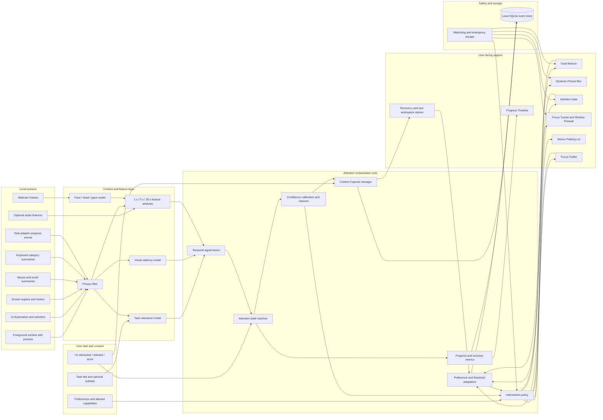
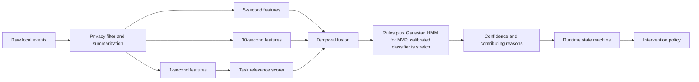
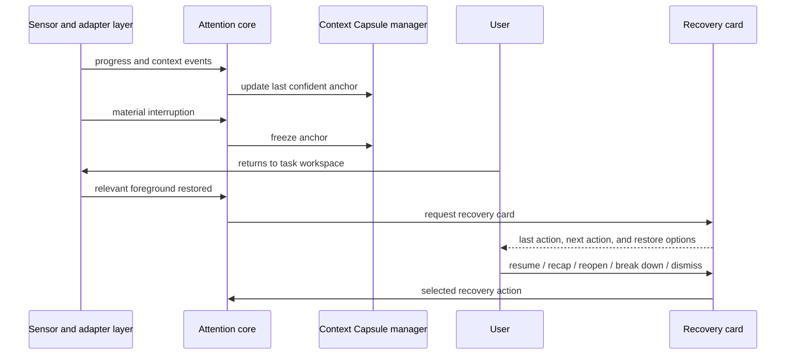

# Anchor General Task Attention Assistant for Windows

**Status:** Approved design specification  
**Date:** 2026-09-19  
**Platform:** Windows 11; Windows 10 compatibility is not an MVP requirement  
**Primary users:** People with ADHD and related attention or executive-function difficulties  
**Product form:** A background desktop assistant with a tray presence, a small Goal Beacon, contextual overlays, and an optional dashboard

## 1. Executive summary

Anchor is a general-task Windows attention assistant. The user begins a session by entering a short goal such as **Finish biology presentation**. Anchor then infers which applications, documents, sites, and actions are relevant to that goal while observing local desktop, input, progress, webcam, and optional audio signals.

The product behaves more like Grammarly than a conventional productivity application. It remains mostly invisible and appears at the point of need through a narrow always-on-top Goal Beacon, visual filters, intention gates, and recovery cards. A full dashboard exists for configuration and review but is not the primary interaction surface.

Anchor combines five systems:

1. **Multimodal attention inference:** estimates task relevance and attention continuity from multiple uncertain signals rather than treating gaze or inactivity as proof of distraction.
2. **Active prevention:** adds proportional, reversible friction before a likely distraction becomes a full context switch.
3. **Passive and manual recovery:** continuously preserves task context and restores it after interruptions or self-reported distraction.
4. **Progress and personalization:** measures observable task continuity and meaningful progress while learning which safe interventions help each user.
5. **Focus toolkit:** supplies visual simplification, task decomposition, detour parking, sound masking, movement-aware breaks, and task-specific adapters.

The main technical differentiator is the closed feedback loop:

```text
observe local activity
    -> estimate task relevance and attention continuity
    -> preserve context
    -> intervene proportionally
    -> measure recovery and progress
    -> learn from user feedback
```

Anchor does not diagnose ADHD, claim to read the user's mind, or present a clinical attention score.

## 2. Problem evidence and product response

Interview observations add several needs beyond ordinary app blocking:

| Observed problem | Product interpretation | Anchor response |
|---|---|---|
| Detailed pictures, animations, or visually rich objects capture attention | Visual salience can overpower task relevance | Dynamic Picture Blur, motion suppression, peripheral dimming, and reduced-stimulation presets |
| An interruption causes the user to forget what they were doing | Working context is fragile across task switching | Context Capsules, automatic Recovery Anchor, and workspace restoration |
| Sudden sounds or uncomfortable lighting make work difficult | Environmental stimulation can become a competing signal | Optional transient-noise detection, stable sound masking, reduced-brightness themes, and user-controlled sensory presets |
| The user needs to move or fidget | Movement can support regulation and must not be treated as failure | Fidget-tolerant inference and optional movement-aware breaks |
| Attention jumps forward or stalls on one phrase while reading | Reading has task-specific skip and stuck states | Reading adapter with semantic progression, future-text masking, and phrase assistance |
| The user notices distraction before the system does | Internal attention lapses are not always externally observable | Persistent **I'm distracted** button and global hotkey with immediate recovery |

## 3. Scope

### 3.1 General assistant with task adapters

The core product supports any declared desktop task. Specialized adapters add richer progress signals for reading, writing, coding, research, and presentation work.

```text
General task core
├── reading adapter
├── writing adapter
├── coding adapter
├── research adapter
├── presentation adapter
└── generic artifact adapter
```

Reading is therefore an important high-information mode, not the definition of the whole product.

### 3.2 Hybrid task model

The user supplies a concise task title and may optionally identify important applications, files, sites, or subtasks. Anchor automatically infers additional relevant context and allows corrections at any time.

This avoids both extremes:

- A fully explicit system creates excessive setup work.
- A fully automatic system has no reliable ground truth and creates unnecessary privacy risk.

### 3.3 Hackathon boundary

**Must work:**

- Task declaration and session lifecycle
- Goal Beacon
- Foreground-application and input sensing
- Task-relevance scoring
- Manual **I'm distracted** recovery
- Context Capsule and recovery card
- Browser-based Dynamic Picture Blur
- Reversible intention gate
- Progress timeline
- Camera-off degraded mode
- Emergency escape and watchdog

**High-value stretch:**

- Coarse gaze and head-pose fusion
- UI Automation or OCR-based cross-application visual filtering
- HMM-based temporal smoothing
- Screen-motion and saliency scoring
- Optional audio-transient features
- Personalized intervention selection
- VS Code, Office, and PDF task adapters

## 4. Product principles

1. **Infer uncertainty, not certainty.** Anchor estimates states and exposes confidence and reasons.
2. **Separate task relevance from attention continuity.** A relevant app can still contain a distraction, and an apparently unrelated app may be needed for the task.
3. **Preserve context before intervening.** Recovery continues even when active prevention is disabled.
4. **Escalate gradually.** Silent observation precedes nudges, visual filtering, and intention gates.
5. **Keep the user in control.** Every intervention is reversible; strong restrictions require explicit opt-in.
6. **Process locally by default.** Raw camera, microphone, screenshot, and globally typed content are not retained.
7. **Remain useful without a camera.** Desktop, input, progress, and self-report signals provide a complete fallback.
8. **Do not punish movement.** Fidgeting is not distraction without supporting evidence.
9. **Avoid becoming another distraction.** No flashing, continuous vibration, streak anxiety, or notification spam.
10. **Fail open.** Crashes or uncertainty remove restrictive behavior rather than trapping the user.

## 5. Chosen architecture

The approved architecture is a native C# Windows host plus an isolated Python inference worker.

### 5.1 Responsibilities

The **C# Windows host** owns:

- tray and session UI
- Goal Beacon and overlays
- Windows hooks and UI Automation
- screen-capture consent and coordination
- intervention policy
- recovery storage and workspace restoration
- safety watchdog and emergency release

The **Python inference worker** owns:

- webcam capture
- face landmarks, head pose, and coarse gaze
- visual saliency and screen-motion analysis
- local semantic embeddings
- temporal attention-state models
- optional audio features

The worker can recommend an intervention but cannot directly block input, confine the pointer, or draw a system-wide overlay.

### 5.2 Complete system diagram



## 6. Task model

Each active task has the following structure:

```text
Task goal
├── current subtask
├── relevant applications and artifacts
├── expected forms of progress
├── temporarily allowed detours
├── parked distractions
└── current recovery anchor
```

### 6.1 Relevance inference

Anchor compares the declared task and current subtask with:

- process and application identity
- window title and document name
- browser URL and page title when an extension is installed
- UI Automation or OCR text
- selected text and active control
- recently accepted relevant destinations
- task-adapter events

The result is a relevance probability and a short explanation. User corrections always override model output for the current session and become local feedback for later sessions.

### 6.2 Task adapter contract

Every adapter implements:

```typescript
interface TaskAdapter {
  observeContext(): TaskContext;
  detectProgress(previous: TaskContext, current: TaskContext): ProgressEvent[];
  captureAnchor(): RecoveryAnchor;
  restoreWorkspace(anchor: RecoveryAnchor): RestoreResult;
}
```

Adapters are optional. The generic adapter uses active applications, artifacts, and user checkpoints when no specialized adapter exists.

## 7. Multimodal distraction inference

Anchor estimates two independent values:

- **Task relevance:** whether the current destination or content is related to the task.
- **Attention continuity:** whether recent behavior resembles purposeful progress, difficulty, detour, interruption, or recovery.

### 7.1 Desktop and screen signals

- foreground process and window handle
- window title and document identity
- foreground changes and duration outside the task set
- taskbar, Start menu, notification center, and virtual-desktop transitions
- UI Automation control type, text, selection, and geometry
- browser URL through an optional extension
- screen-region motion and visual novelty
- notification or badge appearance
- video or animation activity
- salient image and object regions
- OCR text when UI Automation is unavailable and the user approved capture

### 7.2 Mouse and scroll signals

- position, velocity, and acceleration summaries
- movement toward the taskbar, another monitor, or a known distractor
- application-boundary crossings
- rapid erratic movement
- repetitive circling or backtracking
- long hover over unrelated links or controls
- repeated clicks without observable progress
- idle duration
- scroll direction, speed, and oscillation

### 7.3 Keyboard signals

- input cadence and idle intervals
- `Alt+Tab`, Windows key, and task-switch commands
- address-bar focus shortcuts
- repeated escape or cancellation behavior
- navigation-command bursts
- correction or undo/redo bursts inside supported task applications

Globally typed content is not stored. Global input monitoring records categories and timing, not characters. Text content is accessed only through a supported task adapter or an explicitly consented context extractor.

### 7.4 Webcam signals

- face presence and quality confidence
- coarse gaze region
- head orientation
- prolonged off-screen glance
- unstable gaze
- blink-related features used only as weak evidence
- calibration error by screen region

The webcam does not perform identity recognition. Webcam evidence is never sufficient by itself to declare distraction.

### 7.5 Optional audio signals

- short-term RMS level
- sudden volume increase
- transient onset
- spectral-flux change
- speech-presence probability

Only derived values are emitted. Audio samples are discarded immediately and microphone use requires explicit opt-in.

### 7.6 Progress and history signals

- meaningful artifact change
- save, build, test, export, or checkpoint event
- current subtask completion
- reading, writing, coding, research, or presentation adapter progress
- time since last progress event
- session duration
- interruption and recovery history
- accepted and dismissed interventions
- manual distraction reports

### 7.7 Fidget-tolerant interpretation

Mouse or keyboard repetition may support regulation. Repetitive movement is not treated as distraction unless combined with absent progress, low task relevance, or another strong departure signal.

## 8. Temporal attention model

### 8.1 Processing pipeline



### 8.2 Runtime states

| State | Meaning |
|---|---|
| `Idle` | No active task session |
| `Engaged` | Evidence supports purposeful task progress |
| `Drifting` | Continuity is weakening but a material departure is not confirmed |
| `Stuck` | Repetitive activity or dwell continues without progress |
| `TaskDetour` | A destination appears low relevance but may be intentional |
| `Interrupted` | A material departure or absence has occurred |
| `Recovering` | Context is being presented or restored |
| `IntentionalBreak` | The user deliberately paused the task |
| `Uncertain` | Signals conflict or confidence is inadequate |

### 8.3 State-transition rules

- A single gaze jump or application switch never confirms distraction.
- Manual **I'm distracted** transitions directly to `Recovering`.
- Explicit **Needed for task** feedback marks the destination temporarily relevant.
- Repeated low-relevance switching plus missing progress can transition to `TaskDetour`.
- A material foreground departure, prolonged absence, or explicit pause freezes a Context Capsule.
- `Uncertain` permits passive observation and context preservation but no restrictive escalation.
- Returning to the task transitions through `Recovering` before `Engaged` when an anchor exists.

### 8.4 Explainability

Every nontrivial inference records contributing reasons, for example:

```text
state: TaskDetour
confidence: 0.82
reasons:
- foreground changed to a low-relevance application
- no progress event for 74 seconds
- repeated taskbar-directed pointer movement
- destination was not previously marked relevant
```

## 9. Intervention policy

Interventions escalate gradually:

| Confidence and evidence | Response |
|---|---|
| Low | Observe and preserve context only |
| Moderate drift | Brief Goal Beacon nudge |
| Repeated drift | Expand Goal Beacon or reduce peripheral stimulation |
| Likely task detour | Show a reversible intention gate |
| Confirmed interruption | Freeze Context Capsule and wait for return |
| Manual report | Open recovery immediately |

The policy maintains an intervention cooldown and per-session nudge budget so the assistant does not become another source of interruption.

## 10. Goal Beacon

The Goal Beacon is a narrow, always-on-top pill containing the task title and, when useful, the current subtask.

| State | Behavior |
|---|---|
| Engaged | Static, low-contrast task title |
| Mild drift | One brief lateral nudge or soft edge glow |
| Repeated drift | Expands to show the current subtask |
| Likely detour | Shows **Return**, **Needed for task**, **Park for later**, and **Take a break** |
| Manual distraction | Opens the recovery card |

Implementation requirements:

- topmost but non-activating
- click-through outside explicit controls
- no continuous animation
- reduced-motion alternative
- configurable screen edge and monitor
- animation cooldown
- full keyboard accessibility

## 11. Dynamic Picture Blur

### 11.1 Candidate detection

Visual regions are located through, in priority order:

1. DOM image and video rectangles from the browser extension
2. UI Automation image elements and geometry
3. Windows screen capture plus visual-region detection
4. Coarse fallback that dims an unrelated window rather than guessing individual objects

### 11.2 Distraction score

The visual score combines:

- visual saliency
- motion or animation
- semantic irrelevance to the task
- unusual gaze dwell
- surrounding text relevance
- explicit user reveal or relevance feedback

### 11.3 Progressive response

1. reduce saturation
2. dim peripheral imagery
3. blur highly salient irrelevant pictures
4. freeze or cover animated regions
5. reveal temporarily on deliberate hover, click, or user command

The browser adapter applies CSS filters directly. The cross-application MVP uses aligned dim, desaturation, or softened-cover overlays; true pixel blur requires consented capture-and-redraw and is a stretch capability. Anchor never obscures system-critical windows, permission dialogs, secure desktop, or emergency controls.

## 12. Active prevention functions

| Function | What it does | Technical approach | System role |
|---|---|---|---|
| `showIntentionGate()` | Adds reversible friction before a likely detour | Topmost non-activating overlay with return, allow, park, and break actions | Prevent context switch |
| `scoreDestinationRelevance()` | Estimates whether a destination supports the task | Local embedding similarity plus process, URL, history, and explicit rules | Drive proportional gating |
| `parkDetour()` | Saves an interesting link, file, or thought | Local queue with title, URI, note, and timestamp | Remove fear of losing the distraction |
| `applyWindowFirewall()` | Dims low-relevance windows | Per-window overlay aligned to HWND bounds | Reduce peripheral competition |
| `applyFocusTunnel()` | Highlights the working region | UIA/DOM geometry plus transparent dim layer | Maintain visual orientation |
| `applyMouseEdgeFriction()` | Slows taskbar- or boundary-directed movement | Pointer trajectory detection and reversible friction; hard confinement is optional strict mode | Interrupt impulsive exits |
| `confinePointerStrict()` | Confines the pointer to the declared task window when the user explicitly enables strict mode | Win32 `ClipCursor` plus focus-loss release, `Esc`, global emergency hotkey, and watchdog | Optional strong prevention |
| `detectSwitchImpulse()` | Detects repeated task switching | Raw-input categories and foreground hooks | Trigger Goal Beacon |
| `bufferNotifications()` | Defers nonessential interruptions | Focus-session integration and local notification queue where supported | Protect work episodes |
| `applyNoveltyDampener()` | Reduces new badges, thumbnails, and animation | Motion/saliency detection and overlays | Reduce stimulus capture |
| `delayKnownDistraction()` | Adds a short pause before opening a configured distractor | Countdown intention gate with emergency bypass | Add deliberate choice |
| `restoreWorkspace()` | Restores relevant applications and artifacts | Saved HWND/process/document context with adapter-specific restore | Return to task quickly |
| `offerStuckAssistance()` | Offers explanation or a smaller next action | Stuck-state reasons plus task decomposition | Convert stalled activity into progress |

## 13. Passive and manual recovery

### 13.1 Context Capsule

Anchor continuously updates a compact recovery structure:

```typescript
interface RecoveryAnchor {
  taskId: string;
  goal: string;
  subtask?: string;
  capturedAt: number;
  application: ApplicationIdentity;
  artifact?: ArtifactIdentity;
  location?: ContentLocation;
  recentContext?: string;
  lastMeaningfulAction?: string;
  lastConfirmedProgress?: string;
  likelyNextAction?: string;
  workspace: WorkspaceItem[];
  confidence: number;
  reason: "manual" | "app_switch" | "absence" | "idle" | "pause" | "unknown";
}
```

### 13.2 Automatic recovery flow



### 13.3 Manual recovery flow

Pressing **I'm distracted** or the configured hotkey:

1. bypasses model confidence
2. freezes the last confident anchor
3. pauses progress advancement
4. releases cursor restrictions and strong gates
5. opens the recovery card
6. records a self-reported distraction event

### 13.4 Recovery actions

- resume exactly here
- show recent task history
- provide a one-sentence recap
- reopen the task workspace
- break the next action into steps
- mark the event as a false positive
- enter an intentional break

## 14. Focus toolkit

| Tool | Purpose |
|---|---|
| Micro-start | Convert a vague task into a two-minute first action |
| Subtask breadcrumb | Show only the current step and one upcoming step |
| Interruption inbox | Capture unrelated thoughts without opening another app |
| Adaptive sound masking | Provide stable optional sound and respond to sudden environmental noise |
| Reduced-stimulation preset | Reduce animation, contrast variation, imagery, and visual chrome |
| Movement-aware break | Offer a short physical reset after sustained work without penalizing fidgeting |
| Read-aloud | Add an optional auditory channel for reading-heavy tasks |
| Phrase assistance | Explain, simplify, or read a selected difficult phrase |
| Checkpoint prompt | Ask for the next action after suspicious mindless continuation |
| Workspace launcher | Open the task's relevant files and applications together |
| Emergency quiet mode | Disable adaptive effects while retaining the Context Capsule |

## 15. Progress and continuity tracking

Anchor reports observable task continuity, not a neurological attention score.

### 15.1 Evidence hierarchy

1. **High confidence:** saved artifact change, completed subtask, successful build/test, export, or explicit checkpoint.
2. **Medium confidence:** sustained task-relevant editing, navigation, or structured reading movement.
3. **Low confidence:** raw foreground time, typing quantity, mouse movement, or gaze alone.

### 15.2 Metrics

| Metric | Definition |
|---|---|
| Relevant-work ratio | Time in task-relevant context divided by active session time |
| Continuous work episode | Engaged or uncertain task-relevant interval before a material interruption |
| Meaningful progress count | Adapter or user-confirmed progress events |
| Context-switch count | Foreground changes away from the current relevant set |
| Detour count | Low-relevance destinations that required a decision |
| Stuck duration | Time in `Stuck` before progress, assistance, or break |
| Recovery latency | Time from task return to the next meaningful progress event |
| Self-reported distraction count | Manual recovery requests |
| Intervention acceptance | Accepted, dismissed, reversed, or marked incorrect actions |
| Parked-distraction conversion | Parked items later reviewed or discarded |
| Sensor confidence coverage | Portion of the session with usable evidence by channel |
| Stimulation exposure | Time under high visual motion or optional audio-transient conditions |

### 15.3 Example timeline

```text
14:02  Session started: Finish biology presentation
14:08  Meaningful slide edits detected
14:13  Repeated application switching; Goal Beacon nudged
14:14  Unrelated article parked for later
14:22  Interruption detected; Context Capsule frozen
14:25  Task workspace restored
14:26  Meaningful progress resumed
```

## 16. Personalization

Anchor maintains a local preference model containing:

- preferred intervention channel
- sensitivity to motion, imagery, sound, brightness, and overlays
- typical useful work-episode length by task type
- acceptable switching rate
- per-task thresholds
- intervention cooldown and nudge budget
- accepted and dismissed intervention history

Personalization has three layers:

1. **Explicit rules:** user settings always win.
2. **Adaptive thresholds:** rolling statistics adjust sensitivity within safe bounds.
3. **Contextual bandit, stretch:** chooses among already approved safe interventions and learns which one is most often accepted.

Anchor never autonomously enables a new sensor, increases restriction severity, or changes a privacy permission.

## 17. Complete function catalog

### 17.1 Session, task, and consent

| Function | Responsibility |
|---|---|
| `createTask(goal, options)` | Create a declared task and initial relevance model |
| `startSession(taskId)` | Begin sensor collection, recovery capture, and progress tracking |
| `pauseSession(reason)` | Preserve context and release active restrictions |
| `endSession()` | Finalize metrics and remove every overlay, hook, and restriction |
| `requestCapabilityConsent(capability)` | Request camera, microphone, screen, browser, or activity access |
| `setCurrentSubtask(text)` | Update the Goal Beacon and progress expectations |
| `markDestinationRelevant(target, duration)` | Override relevance inference temporarily or permanently |
| `configureEmergencyHotkey()` | Register a global release and manual recovery command |

### 17.2 Windows and application sensing

| Function | Responsibility |
|---|---|
| `subscribeForegroundChanges()` | Receive event-driven foreground-window changes |
| `getForegroundContext()` | Return process, title, HWND, bounds, and application identity |
| `extractUIAutomationContext()` | Read supported text, selection, controls, images, and geometry |
| `captureApprovedWindow()` | Acquire frames only for a user-approved display or application |
| `recordPointerSummary()` | Aggregate motion, boundary, hover, click, and idle features |
| `recordKeyboardSummary()` | Aggregate activity and navigation categories without retaining typed text |
| `detectScreenMotion()` | Measure changing or animated regions |
| `detectVisualRegions()` | Locate images, video, notifications, and salient objects |
| `readBrowserContext()` | Receive URL, title, DOM text, and visual geometry from the extension |

### 17.3 Camera and optional audio

| Function | Responsibility |
|---|---|
| `startCameraWorker()` | Start local camera processing inside the Python worker |
| `calibrateGaze(points)` | Fit a user-specific coarse screen-region mapping |
| `estimateFaceAndGaze(frame)` | Return presence, head pose, coarse gaze, and confidence |
| `summarizeAudioWindow(samples)` | Return level and transient features, then discard samples |
| `reportSensorHealth()` | Expose latency, dropped frames, and confidence coverage |

### 17.4 Relevance and attention inference

| Function | Responsibility |
|---|---|
| `embedTaskContext(text)` | Produce a local task-context vector |
| `scoreContextRelevance(context, task)` | Estimate destination relevance with reasons |
| `buildFeatureWindows(events)` | Produce 1-second, 5-second, and 30-second feature vectors |
| `inferAttentionState(features)` | Combine rules and temporal model predictions |
| `calibrateConfidence(prediction)` | Prevent overconfident intervention decisions |
| `detectStuckState(window)` | Identify repetitive activity without progress |
| `detectInterruption(window)` | Identify material task departure or absence |
| `reportManualDistraction(source)` | Prioritize the user's self-report and enter recovery |
| `recordCorrection(feedback)` | Learn from relevant, incorrect, or unhelpful interventions |

### 17.5 Prevention and visual control

| Function | Responsibility |
|---|---|
| `renderGoalBeacon(state)` | Show the task title and proportional attention cue |
| `scoreVisualDistraction(region)` | Combine saliency, motion, relevance, gaze, and user feedback |
| `applyVisualFilter(region, level)` | Desaturate, dim, blur, or cover a region |
| `revealVisualRegion(region, trigger)` | Temporarily reveal content after deliberate action |
| `showIntentionGate(target)` | Request return, relevance, parking, or break choice |
| `applyWindowFirewall()` | Dim unrelated windows |
| `applyFocusTunnel(region)` | Emphasize the working region |
| `applyMouseEdgeFriction()` | Add reversible resistance near configured boundaries |
| `confinePointerStrict()` | Apply explicit opt-in cursor confinement with mandatory release paths |
| `releaseAllRestrictions()` | Remove gates, friction, confinement, and active overlays |
| `bufferInterruption(event)` | Defer an interruption until a safe release point |
| `parkDetour(target, note)` | Save a destination without navigating to it |

### 17.6 Recovery

| Function | Responsibility |
|---|---|
| `updateRecoveryAnchor(context)` | Maintain the latest confident Context Capsule |
| `freezeRecoveryAnchor(reason)` | Finalize the capsule at interruption time |
| `buildDeterministicRecap(anchor)` | Produce a concise recap without an LLM |
| `generateOptionalRecap(anchor)` | Produce a richer labeled recap when enabled |
| `showRecoveryCard(anchor)` | Present resume, recap, restore, decompose, and break choices |
| `restoreTaskLocation(anchor)` | Return to the saved document, selection, page, or region |
| `restoreTaskWorkspace(anchor)` | Reopen or foreground saved task applications and artifacts |
| `handleRecoveryChoice(choice)` | Apply the selected recovery path and record its result |

### 17.7 Progress and personalization

| Function | Responsibility |
|---|---|
| `recordDerivedEvent(event)` | Persist a minimized local event |
| `recordProgressEvent(event)` | Persist task-adapter or explicit progress |
| `calculateWorkEpisodes(events)` | Build continuous task-relevant intervals |
| `calculateRecoveryLatency(events)` | Measure return-to-progress time |
| `renderProgressTimeline(metrics)` | Display an accessible event timeline and summary |
| `updateAdaptiveThresholds(feedback)` | Adjust safe thresholds within configured bounds |
| `selectSafeIntervention(context)` | Choose among user-approved interventions |
| `deleteSessionData(scope)` | Delete session, date-range, or all local history |

## 18. Technical stack

### 18.1 C# Windows host

| Library or API | Use |
|---|---|
| .NET 10 and C# | Stable native host runtime |
| Windows App SDK 2.4 and WinUI 3 | UI, windows, app lifecycle, and Goal Beacon |
| `Microsoft.Windows.CsWin32` | Type-safe Win32 and COM interop generation |
| `SetWinEventHook` and `GetForegroundWindow` | Foreground and application-transition events |
| Raw Input APIs | Mouse and keyboard feature summaries |
| UI Automation / `IUIAutomationTextRange` | Cross-application context and geometry |
| `Windows.Graphics.Capture` | Consent-based display or window capture |
| Windows Composition and Win2D | Overlays, dimming, and filter rendering |
| `Microsoft.Data.Sqlite` | Local task, event, preference, and recovery storage |
| `System.Threading.Channels` | Bounded asynchronous event pipeline |
| `System.Reactive` | Time-window and event-stream operations |
| `CommunityToolkit.Mvvm` | View models and commands |
| `Serilog` | Sensitive-field-aware structured diagnostics |
| DPAPI | Protection for local secrets and optional keys |
| `Google.Protobuf`, `Grpc.Net.Client`, `Grpc.Tools` | Typed Python-worker communication |

### 18.2 Python inference worker

| Library | Use |
|---|---|
| Python 3.11 | Conservative inference runtime chosen for broad native-package compatibility |
| `opencv-python` | Camera, preprocessing, calibration, motion, and image analysis |
| `mediapipe` | Face landmarks, eye regions, and head pose |
| `numpy` and `scipy` | Features, filters, calibration, and optional audio analysis |
| `onnxruntime` | Local relevance, saliency, object, and gaze models |
| `scikit-learn` | Classifier, calibration, preprocessing, and evaluation |
| `hmmlearn` | Gaussian HMM temporal state smoothing |
| `grpcio`, `grpcio-tools`, `protobuf` | IPC service and generated contracts |
| `pydantic` | Configuration and internal validation |
| `sounddevice`, optional | Ephemeral microphone windows |
| `pytest` and `hypothesis` | Model, feature, and state tests |

### 18.3 Local models

- Task relevance: `all-MiniLM-L6-v2` exported to ONNX
- Visual saliency MVP: OpenCV spectral-residual saliency and frame-change magnitude
- Visual saliency stretch: compact ONNX object or saliency model
- Gaze MVP: MediaPipe eye landmarks plus calibrated ridge regression
- Attention state MVP: explicit rules plus `hmmlearn` Gaussian HMM
- Attention state stretch: calibrated gradient-boosted classifier trained on labeled replay data
- Recovery recap MVP: deterministic extraction
- Recovery recap stretch: optional local or remote LLM with explicit labeling and minimum necessary context

PyTorch is excluded from the packaged application. Models are exported to ONNX to reduce deployment size and dependency complexity.

### 18.4 IPC

The Python worker exposes a gRPC service on loopback with a random per-launch authentication token. Protocol Buffers define:

- `SensorWindow`
- `VisualRegion`
- `GazeEstimate`
- `TaskRelevanceResult`
- `AttentionPrediction`
- `WorkerHealth`

The Python worker owns webcam frames; raw video does not cross IPC. Screen images cross only when visual analysis is enabled. Shared-memory frame transfer is a stretch optimization, not an MVP dependency.

### 18.5 Browser and application adapters

- Edge/Chrome TypeScript WebExtension for URL, DOM text, image rectangles, CSS filtering, and reading progress
- UI Automation adapters for Office, PDF readers, and generic desktop controls
- VS Code extension for active file, build, test, and workspace events as a stretch goal
- Generic artifact adapter for all unsupported applications

### 18.6 Packaging

- self-contained x64 Windows App SDK deployment for the hackathon; MSIX is a post-demo packaging step
- PyInstaller-bundled inference worker
- pinned dependency lock files
- host-controlled worker startup, health checking, restart, and termination

## 19. Local data model

```typescript
interface DerivedEvent {
  timestamp: number;
  taskId: string;
  source: "window" | "input" | "screen" | "camera" | "audio" | "adapter" | "manual";
  type: string;
  features: Record<string, number | boolean | string>;
  confidence: number;
}

interface AttentionPrediction {
  timestamp: number;
  taskRelevance: number;
  continuity: number;
  state: AttentionState;
  confidence: number;
  reasons: string[];
}

interface ProgressEvent {
  timestamp: number;
  taskId: string;
  adapter: string;
  kind: string;
  summary: string;
  confidence: number;
}

interface InterventionEvent {
  timestamp: number;
  type: string;
  triggerPredictionId: string;
  response?: "accepted" | "dismissed" | "reversed" | "incorrect";
}
```

Raw frames and audio are excluded from the persistent schema.

## 20. Privacy, safety, and accessibility

### 20.1 Privacy

- All sensing capabilities are separately consented.
- Raw webcam frames remain inside the inference worker and are discarded.
- Audio windows are discarded immediately after feature extraction.
- Screen capture is limited to a user-approved display or window.
- Global keyboard monitoring stores timing and command categories, not typed characters.
- Context text is retained only when required for a visible recovery capsule.
- Session data can be deleted by session, date range, or entirely.
- Cloud APIs are opt-in and receive only the minimum selected context.

### 20.2 Safety

- `Esc` always releases active intervention.
- A separate global emergency hotkey disables all overlays and restrictions.
- The host watchdog removes stale overlays and releases cursor control.
- The Python worker cannot block input or own system-wide intervention windows.
- Strong restriction requires explicit opt-in.
- Secure desktop, Task Manager, permission dialogs, and system-critical windows are never obscured.
- Confidence conflict enters `Uncertain` rather than escalating.

### 20.3 Accessibility

- full keyboard navigation
- screen-reader names for every control
- high-contrast support
- reduced-motion mode
- configurable color, opacity, blur, and animation
- textual alternative for every chart
- no shame language or streak-loss framing
- no medical or diagnostic claims

## 21. Failure handling and degraded modes

| Failure | Required response |
|---|---|
| Camera unavailable | Reweight desktop, input, progress, and manual signals |
| Camera calibration poor | Disable gaze-dependent behavior and expose confidence |
| UI Automation has no useful context | Use process/title metadata; request capture only when necessary |
| Screen capture refused | Disable OCR and cross-app region filtering without blocking the session |
| Python worker crashes | Continue basic host operation and release restrictive interventions |
| Overlay becomes unresponsive | Watchdog destroys it and releases pointer controls |
| Relevance uncertain | Observe or ask; do not gate |
| Signals conflict | Enter `Uncertain` and preserve context only |
| User reports false positive | Undo intervention and record corrective feedback |
| Adapter unavailable | Use generic artifact and relevant-window tracking |
| Model exceeds latency budget | Drop frames, reduce sampling, or revert to rules |
| Database unavailable | Continue an ephemeral session and notify the user without blocking work |

## 22. Testing and evaluation

### 22.1 Deterministic event replay

Build a recorder/replayer for derived events. Scripted timelines must cover:

- engaged task progress
- relevant research detour
- irrelevant application switch
- visual-distraction escalation
- stuck behavior
- automatic interruption and return
- manual distraction recovery
- camera loss
- Python-worker failure
- emergency release

This allows the state machine and policy engine to be tested without depending on live behavior.

### 22.2 Unit and integration tests

- xUnit for C# state, policy, storage, and adapter contracts
- pytest for Python features and model behavior
- property-based tests for state-transition invariants
- gRPC contract tests
- multi-monitor and DPI geometry tests
- crash and watchdog tests
- privacy tests proving raw media is not persisted
- accessibility checks for Goal Beacon and recovery cards

### 22.3 Evaluation metrics

- intervention precision from accepted versus incorrect feedback
- recovery latency with and without Context Capsules
- task-relevance accuracy on a labeled application/window set
- camera confidence coverage
- false-positive rate per hour
- time and clicks required to resume work
- CPU, memory, and battery impact
- user-rated interruption helpfulness

The evaluation does not claim to measure clinical ADHD severity or neurological attention.

## 23. Hackathon delivery order

### Foundation

1. C# host, task/session contracts, and event bus
2. tray presence, Goal Beacon, and emergency release
3. foreground-window and input sensors
4. local SQLite event store
5. Python worker and gRPC health contract

### Core loop

6. task-relevance baseline
7. rules-based attention state machine
8. Context Capsule capture
9. manual and automatic recovery cards
10. progress timeline

### Demonstrable prevention

11. browser extension
12. dynamic picture blur
13. intention gate and detour parking
14. Window Firewall or Focus Tunnel

### Technical depth

15. MediaPipe face/head/gaze features
16. temporal HMM
17. screen-motion and saliency features
18. UI Automation context extraction
19. optional audio transient features
20. adaptive thresholds

If time slips, preserve the complete observe -> infer -> prevent -> recover -> measure loop and cut optional sensors before cutting safety or recovery.

## 24. Demonstration script

1. Enter **Finish biology presentation**.
2. Anchor displays a quiet Goal Beacon.
3. Edit the presentation; the adapter records meaningful progress.
4. Open a relevant research source; Anchor allows it because semantic relevance is high.
5. Open an animation-heavy unrelated page; Dynamic Picture Blur reduces salient imagery.
6. Move toward another distractor; the Goal Beacon nudges and the intention gate appears.
7. Choose **Park for later** and return to the presentation.
8. Trigger an interruption by switching away or leaving the camera.
9. Return; Anchor shows the last meaningful action and likely next step.
10. Press **I'm distracted** while remaining visibly active to demonstrate recovery for an invisible lapse.
11. Open the timeline and show task continuity, detours, recovery latency, and model reasons.
12. Turn the camera off and repeat manual recovery to demonstrate graceful degradation.
13. Terminate the Python worker and show that the host releases interventions and continues safely.

## 25. Novelty and competitive positioning

Individual elements already exist elsewhere:

- Microsoft Immersive Reader provides line focus and visual-crowding tools.
- Windows Focus suppresses notifications and taskbar alerts.
- focus applications provide timers, blocklists, persistent task titles, or context-aware blocking.
- research prototypes use gaze, local activity monitoring, or contextual recovery.

Anchor should not claim to invent those components. Its differentiator is their integration into a local, confidence-aware closed loop for general desktop tasks:

- declared task plus automatic relevance inference
- multimodal temporal attention modeling
- dynamic stimulus reduction
- proportional and reversible prevention
- automatic and manual context recovery
- measurable return-to-progress behavior
- intervention personalization based on user correction

The judge-facing technical story is not **we made an app blocker**. It is **we built an explainable attention-control system that senses, acts, measures whether the action helped, and degrades safely**.

## 26. Technical references

- [Microsoft: Windows application development](https://learn.microsoft.com/en-us/windows/apps/)
- [Microsoft: Windows App SDK and current developer releases](https://learn.microsoft.com/en-us/windows/apps/whats-new/whats-new-for-developers)
- [Microsoft: CsWin32 interop guidance](https://learn.microsoft.com/en-us/windows/apps/develop/interop/call-win32-apis)
- [Microsoft: UI Automation Text and TextRange](https://learn.microsoft.com/en-us/windows/win32/winauto/uiauto-implementingtextandtextrange)
- [Microsoft: Windows.Graphics.Capture](https://learn.microsoft.com/en-us/windows/uwp/audio-video-camera/screen-capture)
- [Microsoft: Raw Input](https://learn.microsoft.com/en-us/windows/win32/inputdev/about-raw-input)
- [Microsoft: SetWinEventHook](https://learn.microsoft.com/en-us/windows/win32/api/winuser/nf-winuser-setwineventhook)
- [Microsoft: Microsoft.Data.Sqlite](https://learn.microsoft.com/en-us/dotnet/standard/data/sqlite/)
- [ONNX Runtime: Windows](https://onnxruntime.ai/docs/get-started/with-windows.html)
- [ONNX Runtime: Python](https://onnxruntime.ai/docs/get-started/with-python.html)
- [Google AI Edge: MediaPipe Face Landmarker](https://ai.google.dev/edge/api/mediapipe/python/mp/tasks/vision/FaceLandmarker)
- [gRPC documentation](https://grpc.io/docs/)
- [Microsoft: Immersive Reader in Word](https://support.microsoft.com/en-us/accessibility/word/use-immersive-reader-in-word)
- [Microsoft: Focus in Windows](https://support.microsoft.com/en-us/windows/experience/focus-stay-on-task-without-distractions-in-windows)

## Final recommendation

Build the general-task core around the Goal Beacon, task-relevance model, Context Capsule, manual recovery button, browser Dynamic Picture Blur, and intention gate. These features demonstrate the complete system loop with or without a webcam. Add gaze, cross-application visual analysis, audio sensing, and learned personalization only after the safety watchdog, degraded modes, and deterministic event replay are working.

This scope is technically substantial because it combines native Windows event integration, accessible system overlays, local interprocess communication, multimodal feature extraction, temporal state inference, task-specific progress adapters, privacy boundaries, and measurable recovery behavior in one coherent assistant.
