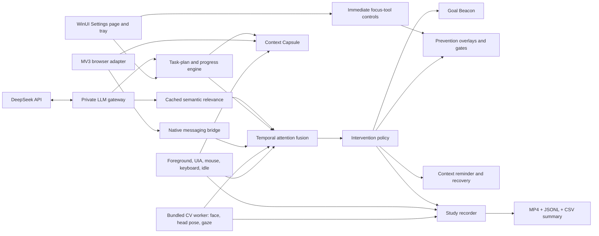

# Anchor Release Rebuild Design

**Status:** Approved in-chat design, pending written-spec review  
**Date:** 2026-09-20  
**Platform:** Windows 11 x64  
**Product:** ADHD-oriented, Grammarly-like background task assistant  
**Release form:** Portable Windows release led by `Anchor.exe`, with bundled local worker and browser-adapter setup

## 1. Outcome

This rebuild turns Anchor from a disconnected hackathon scaffold into a working end-to-end assistant. A user declares a goal, DeepSeek converts it into a concrete task plan, Anchor observes local desktop and calibrated gaze signals, and the Goal Beacon displays the active subtask. Anchor applies reversible prevention when evidence of distraction accumulates and restores context after distraction. A study recorder captures comparable with-Anchor and baseline trials for demonstrations and user testing.

The release is successful only when a person can launch `Anchor.exe`, configure gaze, start a task, see the beacon, trigger desktop and browser interventions, recover context, advance through subtasks, record a trial, and replay the resulting video without installing Python.

## 2. Why the first version failed

The first version implemented interfaces and deterministic demonstrations without connecting the real runtime boundaries:

- `WindowsSensorCoordinator` supplied a constant gaze value and never opened a camera.
- Desktop switches for image blur and future-text masking did not invoke any service.
- The browser adapter depended on an unregistered native-messaging host and manual per-tab injection.
- Relevance used token overlap between a task and a window title rather than semantic intent.
- The published desktop executable did not bundle the Python worker, so multimodal behavior normally degraded to deterministic rules.
- Overlays were not verified through a visible end-to-end desktop test, allowing the beacon and context reminder to exist in code without proving that users could see them.

The rebuild treats those as integration defects, not threshold-tuning problems.

## 3. Product behavior

Anchor behaves like Grammarly rather than a conventional full-screen productivity application:

1. Opening Anchor shows the **Settings page**, the full foreground window used for setup, session controls, diagnostics, recordings, and review.
2. Starting a session can hide the Settings page while Anchor remains available through a stationary notification-area icon.
3. A small, stationary Goal Beacon remains visible without stealing focus.
4. The beacon normally shows the overall goal, current subtask, and progress count.
5. Sensors run in the background and produce explainable evidence, never a medical or diagnostic score.
6. Interventions appear only when needed and always provide a quick escape.
7. Clicking the tray icon restores the Settings page. Closing the Settings page keeps an active session running; **Exit Anchor** stops all sensors and workers.

## 4. Release architecture



The desktop host owns lifecycle, UI, safety, persistence, and Windows integration. A bundled local worker owns camera capture, face landmarks, gaze estimation, screen-frame analysis, and recording. DeepSeek receives only minimized text context after explicit opt-in. The browser extension supplies DOM-level control that a generic desktop overlay cannot safely reproduce.

## 5. Real gaze detection and calibration

### 5.1 Computer-vision pipeline

The bundled worker uses OpenCV for camera capture and MediaPipe Face Landmarker/Face Mesh for face, eye, iris, and head-pose landmarks. It emits:

- camera and face availability;
- normalized coarse gaze coordinates;
- gaze confidence and calibration error;
- face-present and face-away duration;
- head yaw, pitch, and roll;
- gaze dispersion and stability over a bounded temporal window;
- blink/eye-closure quality signals used only to reject unreliable samples.

No identity recognition is performed. Raw frames remain in memory unless the user explicitly enables the webcam thumbnail in a recording.

### 5.2 Calibration

A nine-point calibration fits screen coordinates from iris position and head-pose features. Robust regression rejects blinks and low-confidence samples. Runtime smoothing uses a user-adjustable exponential filter and never treats a single gaze jump as distraction.

Calibration is stored per camera and display layout. A changed camera, resolution, display geometry, or high residual error invalidates the calibration and asks the user to recalibrate.

### 5.3 Test Gaze page

The Settings page contains **Test gaze**. It shows a live camera preview, detected face/eye landmarks, predicted gaze cursor, target point, confidence, sample rate, and current calibration error. A user can test all screen corners before accepting calibration.

Adjustments are provided for displaced or unusual camera mounting:

- camera device;
- mirror on/off;
- rotation: 0°, 90°, 180°, or 270°;
- horizontal and vertical calibration compensation;
- smoothing amount;
- gaze sensitivity;
- minimum detection confidence;
- reset and repeat calibration.

Every adjustment updates the preview immediately. **Restore recommended settings** returns to safe defaults. Anchor disables gaze-dependent decisions and displays **Camera unavailable** or **Calibration unreliable** when confidence is insufficient; desktop and input sensing continue.

## 6. DeepSeek task and intention intelligence

### 6.1 Privacy boundary

The user enables DeepSeek in Settings and supplies an API key. The key is encrypted for the current Windows account using DPAPI and never written to logs. Anchor sends only:

- declared goal and current subtask;
- foreground process name, redacted title, domain, and coarse artifact type;
- user-approved relevant applications, sites, and files;
- minimized progress evidence.

Anchor never sends screenshots, webcam frames, gaze coordinates, raw keystrokes, passwords, selected private text, or secure-window metadata. A preview lists exactly what will be transmitted. DeepSeek can be disabled at any time.

### 6.2 Task breakdown

At session start, the LLM returns validated JSON containing:

- a concise restatement of the goal;
- two to eight ordered subtasks;
- a visible completion criterion for each subtask;
- likely relevant applications, domains, and artifact types;
- the smallest suggested first action.

For **Do 3 USACO questions**, the plan becomes three question subtasks rather than generic advice. The user may edit, reorder, add, or remove subtasks before or during the session.

### 6.3 Dynamic progress

The active subtask advances from one of three evidence levels:

1. **Explicit:** the user presses **Done**; this advances immediately.
2. **Adapter-confirmed:** a supported browser or task adapter detects a submission, completed checklist item, saved artifact milestone, or other high-confidence event.
3. **Suggested:** the LLM judges that available evidence probably satisfies the criterion; Anchor asks for one-click confirmation and never silently marks ambiguous work complete.

The Goal Beacon updates as soon as progress changes and displays `2 of 3` plus the current subtask. Progress events are persisted locally and included in the study summary.

### 6.4 Relevance and intention evaluation

DeepSeek evaluates a context only when its process, document title, domain, or active subtask materially changes. Results are cached by normalized task/context pair and expire after a bounded interval. The structured result contains:

- relevance from 0 to 1;
- `relevant`, `ambiguous`, or `likely_detour` classification;
- a short reason suitable for the interface;
- whether the destination is plausibly required for the current subtask;
- suggested evidence that would change the judgment.

The LLM result is one signal. User overrides have higher authority, and gaze alone never declares distraction. Network errors, invalid JSON, timeouts, and missing keys produce a clearly labeled **Local fallback** rather than pretending that an LLM judgment occurred.

The gateway uses DeepSeek's OpenAI-compatible HTTPS API, JSON output, bounded timeouts, schema validation, retry limits, and a configurable model whose release default is `deepseek-flash`.

## 7. Multimodal attention inference

Anchor fuses independent evidence over time:

- LLM task relevance and user relevance corrections;
- foreground application, document, domain, and application switches;
- keyboard activity categories without typed content;
- mouse travel, boundary movement, clicks, and scroll reversals;
- idle time;
- gaze-on-screen, gaze-away duration, dispersion, and coarse region;
- face presence and head pose;
- browser reading progression and page events;
- task-progress events;
- manual **I'm distracted** reports.

The state machine exposes `Focused`, `Drifting`, `Distracted`, `Recovering`, `Stuck`, and `Unknown`, with confidence and reason codes. A single app switch, gaze jump, face loss, or LLM result cannot independently produce a strong intervention. Secure windows suppress capture and interventions.

## 8. Goal Beacon

The beacon is a DPI-aware, always-on-top, no-activation window positioned inside the active monitor's working area. It remains visible when the Settings page is hidden and is recreated if Explorer or the display layout changes.

Normal state:

- stationary—no continuous animation;
- current subtask is the primary line;
- overall goal and progress count are secondary;
- click-through except for an optional expand button.

When sustained multimodal evidence crosses the distraction threshold, the beacon performs one short horizontal shake: approximately ±8 logical pixels for no more than 700 ms. It does not flash, continuously pulse, or repeat more than once during the intervention cooldown. Reduced-motion mode replaces the shake with a static border/color emphasis.

The shake is a genuine translation animation on the beacon window/content, not only an opacity change. Automated state tests and a visible Windows test must prove that:

- the beacon appears after session start;
- it remains above a browser and local document;
- its text changes when the subtask advances;
- the shake changes its position and returns it to the original position;
- emergency release and session stop close it.

## 9. Prevention mechanisms

The rebuilt prevention layer implements the mechanisms selected in the existing specifications:

- quiet Goal Beacon and one-shot distraction shake;
- gaze-centered spotlight with slow, confidence-gated movement;
- peripheral dimming and reduced-stimulation overlay;
- low-relevance window firewall aligned to the foreground window;
- reversible intention gate with **Return**, **Needed for task**, **Park for later**, and **Take a break**;
- optional pointer edge friction/guard with immediate `Esc` release;
- browser Dynamic Picture Blur based on salience, animation, surrounding relevance, and unusual gaze dwell;
- browser future-text mask, reading frontier, skipped-section cue, phrase-stuck help, and animation suppression;
- detour parking and configurable site/application relevance overrides.

Toolkit controls apply immediately so the user can see and test them without waiting for automatic distraction detection. Every control includes a visible **Preview** action and current status. Desktop overlays affect the active desktop application; browser-specific controls additionally alter page elements through the adapter.

## 10. Recovery mechanisms

Anchor continuously updates a minimized Context Capsule while confidence is adequate. It contains the goal, current subtask, application/document identity, coarse location, last meaningful action, and smallest next action.

Recovery starts when distraction is inferred, when the user returns after an interruption, or when the user presses **I'm distracted**/`Ctrl+Shift+F12`. Manual recovery bypasses confidence thresholds.

The context reminder is an always-on-top interactive card that visibly contains:

- **You were doing:** current subtask;
- **Last safe context:** application/document and last action;
- **Next smallest action:** LLM plan or adapter-derived continuation;
- **Resume**, **Recap**, **Break down**, **Reopen**, **Take a break**, and **Dismiss**.

The card is centered on the active monitor, never behind the Settings page, and remains until the user acts. If no safe anchor exists, it states that the context is estimated. **Break down** requests a smaller DeepSeek step when available and otherwise uses the existing task plan.

## 11. Study recorder and A/B comparison

### 11.1 Trial setup

The Settings page provides **Start study recording**. The user chooses:

- **Anchor enabled** or **Baseline / no interventions**;
- a non-identifying participant code;
- selected display;
- whether to include the webcam thumbnail;
- whether microphone audio is included, default off;
- output folder.

Baseline trials keep gaze and activity measurement active but disable all adaptive interventions. This makes with-app and without-app gaze metrics comparable.

### 11.2 Recording output

The bundled worker records a 15–30 FPS MP4 containing the selected screen and an overlay with:

- calibrated gaze point and confidence ring;
- face-present/away state;
- current task and subtask;
- attention state and reason summary;
- intervention markers;
- optional consented webcam thumbnail.

Each trial also writes:

- JSONL derived events;
- CSV time series;
- summary JSON with duration, usable-gaze coverage, gaze-away time, low-relevance time, task switches, interventions, recovery latency, and completed subtasks.

Raw webcam frames are included only in the MP4 when explicitly selected and are never persisted separately. Recording stops cleanly on request, shutdown, camera failure, display loss, or disk-space error, and the partially completed file is finalized when possible.

### 11.3 Comparison

The Settings page contains a visible **Compare recordings** button. It opens a trial selector, requires one Anchor-enabled recording and one baseline recording, validates that their files are readable, and then renders the comparison report in the Settings page. The button remains available whenever the foreground Settings page is open; no comparison UI appears while Anchor is operating only in the background.

The comparison reports metric differences without making clinical claims:

- on-screen/task-region gaze proportion;
- gaze-away duration;
- low-relevance foreground duration;
- interruption count;
- median recovery latency;
- subtask completion count and time.

The report explicitly labels a single-person demo as observational evidence, not proof of efficacy.

## 12. Browser and desktop integration

The release contains:

- the MV3 extension;
- a native-messaging host executable/bridge;
- per-user registration scripts with uninstall support;
- an in-app connection test;
- a browser-adapter status indicator.

The extension runs only on explicitly enabled HTTP(S) sites and excludes password, payment, browser-internal, permission, and user-denied pages. When connected, desktop toolkit settings and current task state propagate immediately. Without the extension, desktop overlays and sensing still work, while the interface clearly labels DOM-specific features as unavailable.

Generic local documents and PDFs use foreground sensing, UI Automation where available, screen-level gaze, and overlays. Anchor does not claim semantic paragraph control in applications that do not expose text geometry.

## 13. Packaging

The build produces:

```text
release/Anchor-win-x64/
├── Anchor.exe
├── Anchor.VisionWorker.exe
├── Anchor.NativeBridge.exe
├── browser-extension/
├── setup-browser-bridge.ps1
├── remove-browser-bridge.ps1
├── README.txt
└── licenses/
```

`Anchor.exe` automatically locates and starts the bundled worker using a random loopback authentication token. A Python installation is not required. Worker startup, health, camera capability, bridge connection, and DeepSeek availability appear separately in Settings diagnostics. Failure of any optional subsystem leaves the Settings page usable and identifies the degraded mode. The hackathon build is an unsigned portable release unless the team supplies a Windows code-signing certificate.

## 14. Safety and failure handling

- `Esc` releases all restrictive overlays and pointer constraints.
- `Ctrl+Shift+A` restores the Settings page.
- `Ctrl+Shift+F12` opens manual recovery.
- Camera permission denial leaves a fully usable camera-off mode.
- DeepSeek failure never blocks starting or stopping a session.
- Secure windows clear overlays and pause screen/camera-derived contextual capture.
- Watchdog expiry releases interventions.
- Recording requires explicit start and displays a persistent recording indicator.
- Raw keys and typed text are never stored.
- The app provides delete controls for history, recordings, calibration data, and the encrypted API key.

## 15. Verification strategy

### 15.1 Automated tests

- C# unit tests for task-plan validation, subtask advancement, LLM caching/fallback, state fusion, policy, recovery, recording manifests, and comparison calculations.
- C# integration tests for worker lifecycle, authenticated IPC, overlay lifecycle, native bridge messages, and shutdown recovery.
- Python tests with fixture frames for face presence, coarse left/center/right gaze, low-confidence rejection, calibration transforms, parameter changes, and recorder finalization.
- Browser tests for immediate settings updates, image/background-image blur, dynamic DOM changes, future-text mask, animation suppression, page protection, reading progress, and native bridge reconnection.
- Deterministic replay tests for relevant research, likely detour, gaze-away drift, stuck reading, manual recovery, subtask completion, worker failure, and LLM failure.

### 15.2 Visible Windows tests

The release candidate must be opened and visually tested—not only checked as a background process. The test matrix includes:

- `usaco.guide` and `usaco.org` for task relevance and coding-task progression;
- `codeforces.com` and `luogu.com.cn` for relevant/ambiguous competitive-programming contexts;
- `youtube.com` for likely-detour gating and visual filtering;
- `collegeboard.org` and the public portion of `shs.blackboardchina.cn` without entering credentials;
- a local PDF and a local text/Word-compatible document;
- switching between a relevant browser tab and an unrelated local application;
- Goal Beacon appearance, text update, one-shot shake, and reduced-motion alternative;
- context reminder visibility after both manual and automatic recovery;
- toolkit preview effects on a browser and local document;
- Test Gaze calibration with camera displacement adjustments;
- a short Anchor-enabled recording and a short baseline recording, followed by playback and comparison.

Extension installation and camera permission are user-visible privileged steps and are confirmed at action time during testing.

## 16. Release acceptance criteria

The rebuild is demo- and release-ready when all of the following are true:

1. `Anchor.exe` launches the Settings page on a clean Windows 11 x64 user account without Python.
2. The tray icon, Settings-page restore, background session, and exit lifecycle work.
3. Test Gaze detects a real camera, calibrates, exposes confidence, and visibly responds to parameter changes.
4. The worker supplies nonconstant gaze data to attention fusion.
5. DeepSeek produces validated subtasks and semantic relevance when configured; failures are explicit and recoverable.
6. The current subtask and progress update in both Settings page and Goal Beacon.
7. The beacon is visible and performs the one-shot shake on a confirmed distraction.
8. Toolkit controls cause immediate visible desktop or page changes.
9. The intention gate explains an LLM-informed judgment and accepts user correction.
10. Manual and automatic recovery show a visible, actionable context reminder.
11. Browser settings reach an enabled tab through the native bridge.
12. A local PDF/document receives applicable desktop overlays and sensing.
13. Study recording produces a playable MP4 plus valid event and metric files.
14. The **Compare recordings** button on the Settings page compares an Anchor-enabled trial with a baseline trial and reports validated metric differences.
15. Automated suites, deterministic replays, visible Windows tests, package launch, and clean shutdown all pass.

## 17. Explicit limits

- Webcam gaze is coarse and suitable for screen regions or paragraph-sized areas, not precise word-level eye tracking.
- DeepSeek relevance is probabilistic and subordinate to user corrections.
- Cross-application overlays can dim, spotlight, gate, and cover detected regions; exact DOM element manipulation remains browser-adapter functionality.
- The release is an assistive hackathon product, not a diagnostic tool or clinical efficacy study.
